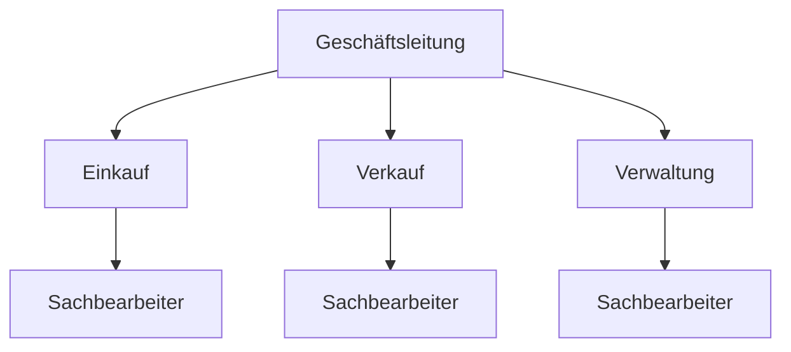
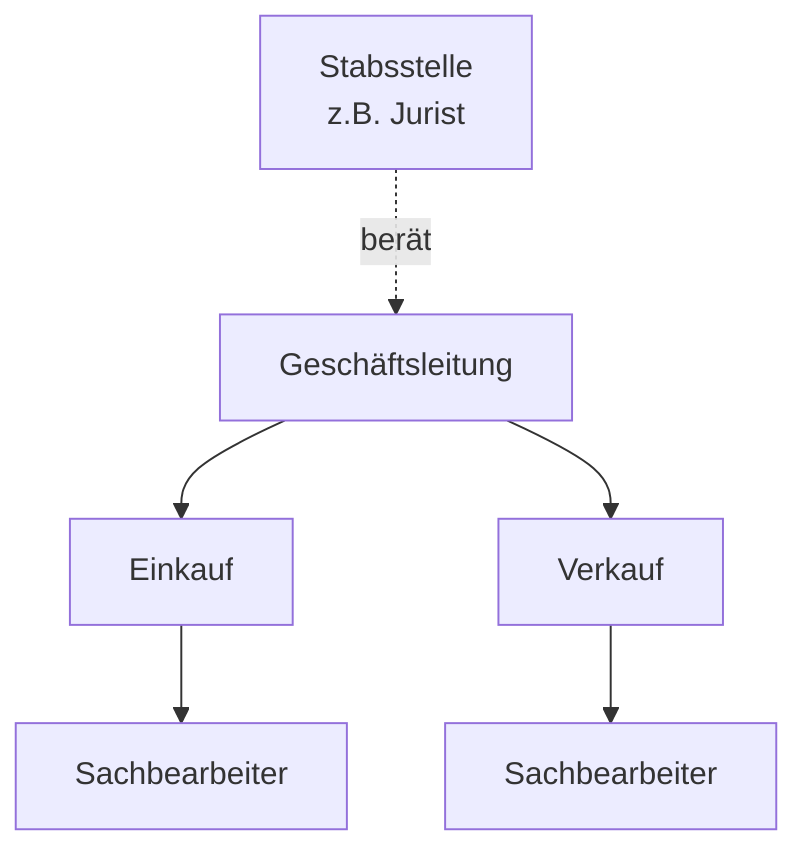

**Organisation** = dauerhafte Regelung von Aufbau und Ablauf betrieblicher Aufgaben. Die **Aufbauorganisation** legt das statische Gerüst fest: Wer ist wem unterstellt, wer hat welche Befugnisse – das „Skelett" des Unternehmens.

## Grundbegriffe / Organisationseinheiten

| Begriff | Definition |
|---|---|
| **Stelle** | Kleinste organisatorische Einheit; Aufgabenbereich einer oder mehrerer Personen, ohne Leitungsbefugnis |
| **Instanz** | Stelle **mit** Leitungsbefugnis (= Führungsstelle, gibt Weisungen) |
| **Stabsstelle** | Leitungshilfsstelle: Beratung + Vorschlagsrecht, aber **keine** Weisungs-/Entscheidungsbefugnis |
| **Abteilung** | Mehrere Stellen unter einheitlicher Leitung |

**Abteilungsbildung:**
- **Verrichtungszentralisation** – nach gleichen Aufgaben (z. B. alle Buchhalter in einer Abt.)
- **Objektzentralisation** – nach gleichen Erzeugnissen/Produkten (z. B. Abt. „Drucker")

> [!important] **Stabsstelle ≠ Instanz**
> Stabsstellen beraten und bereiten Entscheidungen vor, erteilen aber **keine Anweisungen**. Klassisches Beispiel: Jurist als Assistent der Geschäftsführung, Qualitätsbeauftragter.

## Managementebenen

| Ebene | Bezeichnung | Aufgaben |
|---|---|---|
| Oberste Leitungsebene | Strategisches Management (Top Management) | Unternehmensstrategie, Grundsatzentscheidungen |
| Mittleres Management | Taktisches Management | Abteilungsplanung, Umsetzung der Strategie |
| Unteres Management | Operierendes Management | Tagesgeschäft, direkte Mitarbeiterführung |

## Entscheidungssysteme

- **Direktorialsystem**: Ein Entscheider an der Spitze (klassische Hierarchie)
- **Kollegialsystem**: Mehrere entscheiden gemeinsam (einstimmig oder mehrheitlich) – z. B. Vorstand einer AG

## Leitungssysteme

Leitungssystem = Festlegung von Über-/Unterordnung, Weisungsbefugnis und Verantwortungsbereich.

| System | Merkmal | Vorteile | Nachteile |
|---|---|---|---|
| **Einliniensystem** | Jede Stelle hat genau **eine** übergeordnete Instanz | Klare Zuständigkeit, eindeutige Verantwortung | Lange Informationswege, Instanzen als Flaschenhals |
| **Mehrliniensystem** | Stelle erhält Weisungen von **mehreren** Instanzen (Spezialisierungsprinzip) | Spezialisierung der Instanzen, kürzere Wege | Zuständigkeitskonflikte, Kompetenzüberschneidungen |
| **Stab-Linien-System** | Liniensystem + Stabsstellen (beraten, keine Weisungsbefugnis) | Entlastung der Instanzen, Fachberatung | Instanzen können von Stäben abhängig werden |
| **Matrixorganisation** | Variante des Mehrliniensystems: verrichtungs- **und** objektorientierte Instanzen gleichzeitig | Fachspezialisten aus verschiedenen Bereichen wirken zusammen | Zuständigkeitskonflikte, Kompetenzüberschneidungen |

> [!tip] **Merksatz Einliniensystem**
> „Ein Chef, ein Weg" – klare Befehle, aber langsam. Typisch für klassische Behörden/Militär.

### Einliniensystem (Organigramm-Beispiel)



### Stab-Linien-System (Organigramm-Beispiel)



### Matrixorganisation

Zwei Hierarchielinien gleichzeitig: eine nach **Verrichtung** (Funktion) und eine nach **Objekt** (Produkt/Projekt).

```
                 Produktion   Einkauf   Verkauf
Produktmanager A     X           X         X
Produktmanager B     X           X         X
Produktmanager C     X           X         X
```

Produktmanager haben Ergebnisverantwortung, aber keine direkte Weisungsbefugnis über die Funktionsabteilungen → klassisches Kongruenzproblem.

## Prinzip der Kongruenz

Bei jeder Aufgabenübertragung müssen drei Dinge **deckungsgleich** sein:

| Komponente | Bedeutung |
|---|---|
| **Aufgabe** | Was soll getan werden? (Objekt + Verrichtung) |
| **Kompetenz** | Befugnis zur Ergreifung von Maßnahmen |
| **Verantwortung** | Persönliches Einstehen für das Ergebnis |

> [!warning] **Achtung Prüfungsfalle**
> Typische Frage: „Wo wird das Kongruenzprinzip verletzt?" → **Matrixorganisation**: Produktmanager trägt Verantwortung für Ergebnisse, hat aber keine Weisungsbefugnis gegenüber Funktionsabteilungen = Aufgabe ≠ Kompetenz. Lösung: klare Eskalationswege oder echte Entscheidungsbefugnis einräumen.

## Ablauforganisation (Abgrenzung)

Während die **Aufbauorganisation** das statische WER/WAS klärt, regelt die **Ablauforganisation** das dynamische WIE/WANN:

**Aufgabenanalyse** → **Arbeitssynthese** (Arbeitsverteilung) → **Gestaltung des Arbeitsprozesses**

- **Improvisation**: vorläufige Regelung für ungewöhnliche/neuartige Fälle (z. B. Maschinenschaden)
- **Disposition**: Einzelmaßnahme im Rahmen geltender organisatorischer Regelungen (z. B. Bestellung innerhalb einer Vollmacht bis 3.000 €)
