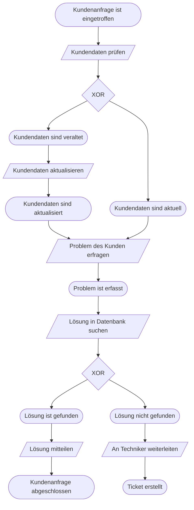

Ein **Geschäftsprozess** ist eine Folge von manuellen, teil-automatisierten oder automatisierten betrieblichen Aktivitäten, die auf ein bestimmtes betriebliches Ziel gerichtet sind. Die EPK (Ereignisgesteuerte Prozesskette) ist das Standard-Werkzeug zur grafischen Modellierung dieser Abläufe.

## Wozu Prozessmodellierung?

Ziele: Dokumentation, Qualitätssicherung, Schulung, Schwachstellenanalyse, Softwareeinführung (z. B. SAP), ISO-Zertifizierung, Workflowmanagement.

Kernaussage: Das Organigramm zeigt **Aufbauorganisation** (Hierarchie, Stellen) – die EPK zeigt **Ablauforganisation** (was passiert wann, in welcher Reihenfolge, wer ist zuständig).

## EPK – Die drei Basissymbole

| Symbol | Form | Beschreibung |
|---|---|---|
| **Ereignis** | Raute / Sechseck | Passiver Zustand, der eingetreten ist; löst Prozess aus oder ist Ergebnis einer Funktion. **Kein** Zeit-/Kostenverbrauch. |
| **Funktion** | Rechteck mit abgerundeten Ecken | Aktive Tätigkeit/Aufgabe; kann Entscheidungen treffen. Immer mit Verb beschriften. |
| **Konnektor** | Kreis mit Symbol | Verbindet / verzweigt den Kontrollfluss (AND, OR, XOR) |

**Weitere Elemente (eEPK):**

| Element | Verbindung zur Funktion |
|---|---|
| Organisationseinheit | gestrichelte Linie (zuständige Stelle/Abteilung, kein Mitarbeiter) |
| Informationsobjekt | Pfeil (Datenfluss – z. B. Kundendatei, Bestellschein) |
| Prozesspfad / Prozesswegweiser | ersetzt Start- oder Endereignis, verbindet Unterprozesse |

> [!important] **Kernregel**
> Ereignisse und Funktionen **wechseln sich immer strikt ab**. Kein Ereignis auf Ereignis, keine Funktion auf Funktion.

## Konnektoren im Detail

| Operator | Symbol | Aufspaltung | Zusammenführung |
|---|---|---|---|
| **UND** (AND) | ∧ | Alle Pfade werden parallel durchlaufen | Alle Pfade müssen abgeschlossen sein |
| **ODER** (OR) | ∨ (V) | Mindestens ein Pfad wird verfolgt | Mindestens ein Pfad muss abgeschlossen sein |
| **Exklusives ODER** (XOR) | XOR | Genau ein Pfad wird verfolgt | Genau ein Pfad wurde abgeschlossen |

> [!warning] **Achtung Falle**
> Ein **ODER- oder XOR-Operator** zur Aufspaltung darf **nicht direkt einem Ereignis folgen** – Ereignisse haben keine Entscheidungskompetenz! Entscheidungen trifft immer die Funktion. Nach der Funktion kommt ein Konnektor, dann die Zweig-Ereignisse.

> [!tip] **Merksatz Konnektoren**
> **AND** = alles, **OR** = mindestens eins, **XOR** = genau eins – gilt sowohl beim Aufteilen als auch beim Zusammenführen.

## Modellierungsregeln (Prüfungsrelevant)

**Allgemeine Regeln:**
- Anfang und Ende: immer ein **Ereignis** (oder Prozesswegweiser)
- Modellierung von **oben links nach unten rechts**
- Jedes Element ist durch einen **Kontrollfluss-Pfeil** verbunden
- Verzweigungen werden mit **demselben Konnektor-Typ** geschlossen, mit dem sie geöffnet wurden

**Regeln für Ereignisse:**
- Kein Ereignis darf direkt auf ein anderes Ereignis folgen
- Ereignisse haben nur **eine Eingangs- und eine Ausgangslinie**
- Ein Ereignis **kann keine Konnektor-Entscheidung auslösen** (kein XOR/OR nach Ereignis)

**Regeln für Funktionen:**
- Keine Funktion darf direkt auf eine andere Funktion folgen
- Funktionen haben nur **eine Eingangs- und eine Ausgangslinie**

**Regeln für Konnektoren:**
- Aufspaltung: 1 Eingang, ≥ 2 Ausgänge
- Zusammenführung: ≥ 2 Eingänge, 1 Ausgang
- Organisations- und Informationsobjekte **nur** mit Funktionen verbinden (nicht mit Ereignissen/Konnektoren)

## EPK vs. eEPK

| Merkmal | EPK | eEPK |
|---|---|---|
| Elemente | Ereignis, Funktion, Konnektor, Kontrollfluss | + Organisationseinheit, Informationsobjekt, Prozesspfad |
| Zeigt Zuständigkeiten | ✗ | ✓ |
| Zeigt Datenflüsse | ✗ | ✓ |
| Verbindet Unterprozesse | nur über Ereignisse | via Prozesswegweiser |

## Beispiel: Einfacher EPK-Ablauf

> [!tip] **Merksatz EPK-Aufbau**
> **E → F → E → F → E** – immer abwechselnd. Konnektoren kommen zwischen Funktionen und Ereignissen, wenn der Fluss sich aufteilt oder zusammenläuft.

## Prozesswegweiser (Prozesspfad)

Komplexe Prozesse werden in **Haupt- und Unterprozesse** aufgeteilt. Der Prozesswegweiser ersetzt dabei das Start- oder Endereignis und stellt die Verbindung her. Das Ereignis vor dem Wegweiser wird im anderen Prozess nach dem Wegweiser wiederholt.

**Anwendungsfall:** Wenn ein Gesamtprozess (z. B. Auftragsbearbeitung) in Teilprozesse zerlegt wird (Einkauf → Produktion → Versand).

> [!warning] **Achtung Prüfung**
> In der AP2 wird oft ein Prozess als **Text** beschrieben – daraus musst du die korrekte EPK/eEPK ableiten. Typische Fehler:
> - XOR nach einem Ereignis setzen (falsch – gehört nach die Funktion)
> - Funktion direkt auf Funktion folgen lassen
> - Verzweigung mit AND öffnen, aber mit XOR schließen
> - Organisationseinheit mit einer gestrichelten Linie mit einem Ereignis verbinden (nur Funktionen!)
