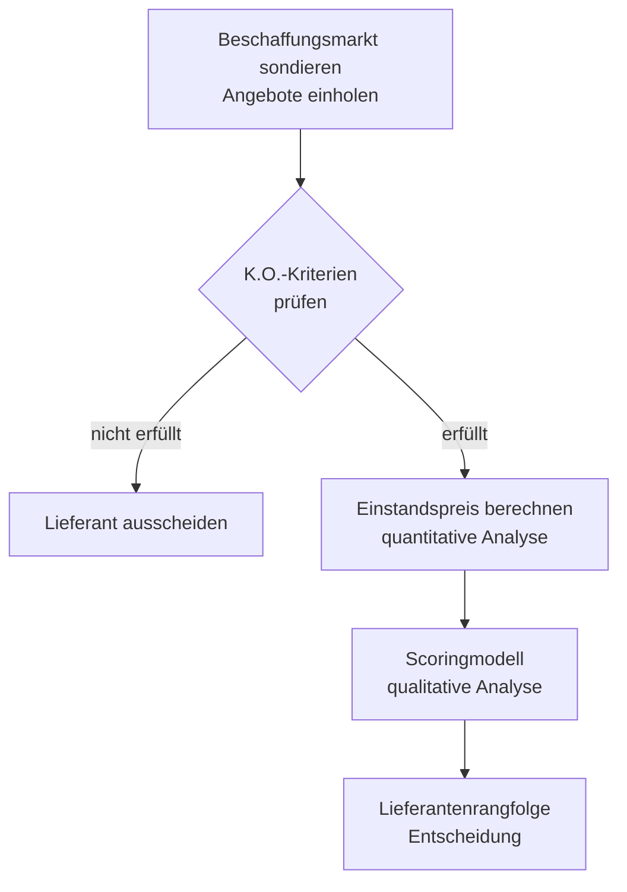

Systematische Bewertung und Auswahl von Lieferanten anhand quantitativer (Preis) und qualitativer (Leistung) Kriterien. Ziel: den optimalen Lieferanten für kurz- und langfristige Beschaffung zu ermitteln.

---

## Grundunterscheidung: kurz- vs. langfristig

| Zeithorizont | Entscheidungskriterium | Methode |
|---|---|---|
| **Kurzfristig** | Minimale Beschaffungskosten | Einstandspreis-Vergleich (quantitativ) |
| **Langfristig** | Qualität, Zuverlässigkeit, Partnerschaft | Scoringmodell (quantitativ + qualitativ) |

> [!important] **Kernregel**
> Günstigster Einstandspreis ≠ bester Lieferant langfristig. Der Preis ist nur ein Kriterium unter vielen.

---

## Schritt 1 – Quantitative Analyse: Einstandspreis berechnen

Der **Einstandspreis** (= Bezugspreis, Einstandspreis je Stück) gibt die tatsächlichen Kosten pro Einheit an, nachdem alle Preisminderungen abgezogen und Bezugskosten addiert wurden.

### Schema

```text
  Listenpreis (Bruttopreis)
- Rabatt (% auf Listenpreis)
= Zieleinkaufspreis (Nettoeinkaufspreis)
- Skonto (% auf Zieleinkaufspreis)
= Bareinkaufspreis
+ Bezugskosten (Transport, Verpackung, Zoll)
= Einstandspreis (Bezugspreis)
```

> [!tip] **Merksatz**
> **L – R – S + B = Einstand** (Listenpreis minus Rabatt minus Skonto plus Bezugskosten)

> [!warning] **Achtung Falle**
> Skonto wird auf den **Zieleinkaufspreis** gerechnet, nicht auf den Listenpreis.
> Bezugskosten kommen **nach** dem Skonto, nicht vorher.
> „frei Haus" = keine Transportkosten zu addieren.

### Beispiel: Fallstudie (Bestellmenge 50 Stück)

| | **Simquick** (DE) | **Compair** (JP) | **Olinetto** (IT) |
|---|---|---|---|
| Listenpreis | 600,00 € | 540,00 € | 530,00 € |
| − Rabatt | − 60,00 € (10 %) | – | – |
| = Zieleinkaufspreis | 540,00 € | 540,00 € | 530,00 € |
| − Skonto | – | − 10,80 € (2 %) | – |
| = Bareinkaufspreis | 540,00 € | 529,20 € | 530,00 € |
| + Bezugskosten | + 10,00 € (Verpackung) | – (frei Haus) | + 5,00 € (Transport) |
| **= Einstandspreis** | **550,00 €** | **529,20 €** | **535,00 €** |

→ Rein quantitativ: **Compair** ist am günstigsten.

---

## Schritt 2 – Qualitative Analyse: Scoringmodell

Da der Preis allein keine hinreichende Grundlage für langfristige Lieferantenbeziehungen ist, folgt eine Bewertung nicht-monetärer Kriterien.

### Vorgehensweise

1. **Kriterien** aus dem Beschaffungsmarkt ableiten (z. B. Lieferzeit, Qualität, Service)
2. **Gewichtung (W)** vergeben: 1–10 Punkte je nach Wichtigkeit
3. **Bewertung (B)** je Lieferant: 0–3 Punkte
   - 3 = sehr gut (sehr hoher Nutzen)
   - 2 = gut (hoher Nutzen)
   - 1 = mäßig (geringer Nutzen)
   - 0 = schwach/keine Ausprägung (kein Nutzen)
4. **Gesamtpunktzahl (G = W × B)** pro Kriterium berechnen, dann summieren
5. Lieferant mit **höchster Gesamtsumme** gewinnt

> [!tip] **Merksatz**
> Scoring = **W × B**, höchste Summe gewinnt. Gewichtung drückt Prioritäten aus.

### Typische Bewertungskriterien

| Kriterium | Beispiel-Gewichtung |
|---|---|
| Lieferzeit / Termintreue | hoch (8–10) |
| Qualität der Produkte | hoch (7–10) |
| Garantie- und Reklamationsabwicklung | mittel–hoch (5–8) |
| Ersatzteilverfügbarkeit | mittel (4–7) |
| Beratung / technischer Service | mittel (4–6) |
| Image / Marktstellung | niedrig–mittel (2–5) |
| Werbungsunterstützung für den Handel | niedrig (2–4) |
| Sprachliche / kommunikative Zuverlässigkeit | je nach Kontext |

### Beispiel-Bewertung aus Fallstudie

| Kriterium | W | Simquick B / G | Compair B / G | Olinetto B / G |
|---|---|---|---|---|
| Lieferzeit | 9 | 3 / 27 | 2 / 18 | 3 / 27 |
| Termintreue | 9 | 3 / 27 | 3 / 27 | 1 / 9 |
| Qualität | 8 | 2 / 16 | 3 / 24 | 2 / 16 |
| Garantieabwicklung | 7 | 3 / 21 | 3 / 21 | 1 / 7 |
| Ersatzteile | 6 | 3 / 18 | 3 / 18 | 1 / 6 |
| Technische Beratung | 5 | 3 / 15 | 3 / 15 | 2 / 10 |
| Image / Marktstellung | 4 | 2 / 8 | 3 / 12 | 1 / 4 |
| Werbungsunterstützung | 3 | 1 / 3 | 2 / 6 | 3 / 9 |
| **Summe** | | | **135** | **141** | **88** |

→ Qualitativ: **Compair** gewinnt knapp vor Simquick. Olinetto fällt durch Termintreue und Ersatzteilprobleme ab.

> [!warning] **Achtung Falle**
> Die Gewichtungen und Bewertungen in der Prüfung sind **vorgegeben** – du trägst nur die Ergebnisse ein und summierst. Keine eigenen Gewichtungen erfinden, wenn eine Tabelle vorliegt.

---

## Zweistufiger Auswahlprozess (Gesamtüberblick)



> [!important] **Kernregel**
> Reihenfolge: erst K.O.-Kriterien (Vorauswahl) → dann Einstandspreis → dann Scoring. Wer K.O.-Kriterien nicht erfüllt, scheidet sofort aus, egal wie günstig.

---

## Prüfungsrelevante Rechenregeln

| Situation | Regel |
|---|---|
| Rabatt „ab X Stück" | Gilt nur wenn Bestellmenge ≥ X, sonst kein Rabatt |
| Verpackungspauschale „je angefangene 10 Stück" | Aufrunden: 50 Stück → 5 × Pauschale |
| „frei Haus" | Keine Bezugskosten (Transport vom Lieferanten getragen) |
| Skonto | Wird nur abgezogen, wenn der Käufer **innerhalb der Skontofrist** zahlt |
| Menge × Einstandspreis | Einstandspreis immer **je Stück** berechnen, dann × Menge für Gesamtkosten |
