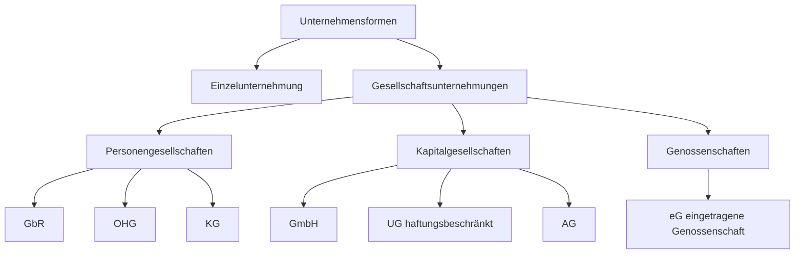

Die Rechtsform bestimmt, wer die Geschäftsführung übernimmt, wer haftet, wie Gewinn verteilt wird und welche Steuern anfallen – sie hat also direkte betriebswirtschaftliche Konsequenzen.

## Überblick: Systematik der Rechtsformen

## Warum die Rechtsform wichtig ist

Die Rechtsform hat Einfluss auf sechs Kernfragen:

| Faktor | Frage |
|---|---|
| Geschäftsführung | Wer ist berechtigt zu entscheiden und zu vertreten? |
| Haftung | In welchem Umfang wird für Schulden gehaftet? |
| Kapital | Wer bringt das Kapital auf? |
| Gewinn | Wem steht der Gewinn zu? |
| Steuern | Welche Steuerarten fallen an? |
| Kreditwürdigkeit | Wie groß ist das Vertrauen der Gläubiger? |

## Vergleichstabelle: Alle Rechtsformen

| Kriterium | Einzelunternehmung | GbR | OHG | KG | GmbH | AG |
|---|---|---|---|---|---|---|
| **Typus** | – | Personenges. | Personenges. | Personenges. | Kapitalges. | Kapitalges. |
| **Kürzel** | e.K. / Kfm. / Kfr. | GbR | OHG | KG | GmbH | AG |
| **Mindestpersonen** | 1 | 2 | 2 | 2 | 1 | 1 |
| **Gesellschaftervertrag** | – | formlos | formlos | formlos | notariell | notariell |
| **Handelsregister** | Eintragung | – | Eintragung | Eintragung | Pflicht | Pflicht |
| **Mindestkapital** | keins | keins | keins | keins | 25.000 € | 50.000 € |
| **Geschäftsführung** | Unternehmer allein | alle gemeinsam | alle Gesellschafter | Komplementär | Geschäftsführer (GV-Kontrolle) | Vorstand (HV + AR) |
| **Haftung** | unbeschränkt (Privat + Geschäft) | alle unbeschränkt (Privat + Gesellschaft) | alle unbeschränkt | Komplementär unbeschränkt; Kommanditist nur Einlage | auf Gesellschaftsvermögen beschränkt | auf Gesellschaftsvermögen beschränkt |
| **Gewinn** | Unternehmer vollständig | gleiche Anteile | 4 % Kapitaleinlage, Rest nach Köpfen | 4 % Kapitaleinlage, Rest nach Risikoanteil | nach Gesellschaftsanteilen | Rücklagenerhöhung + Dividende |
| **Verlust** | Unternehmer vollständig | nach Köpfen | angemessenes Verhältnis | keine Ausschüttung bis Verlust gedeckt | keine Ausschüttung bis Verlust gedeckt | keine Ausschüttung bis Verlust gedeckt |

> [!tip] **Merksatz Haftung**
> **Personen**gesellschaft = **Personen** haften → unbeschränkt mit Privatvermögen.  
> **Kapital**gesellschaft = nur das **Kapital** haftet → Privatvermögen der Gesellschafter ist geschützt.

---

## Einzelunternehmung

Einfachste Form. Eine Person trägt Chancen und Risiken vollständig allein.

**Gründung:** Formlos; ggf. Eintragung ins HR (dann: e.K.)  
**Firmierung:** `Friedrich Neu e. K.`, `Neuzeit Freizeitsport e. K.`

**Vorteile:**
- Volle Entscheidungsfreiheit, kein Abstimmungsaufwand
- Voller Gewinn verbleibt beim Inhaber
- Einfachste Gründung, geringste Kosten

**Nachteile:**
- Unbeschränkte Haftung mit Privatvermögen
- Kapitalaufbringung begrenzt auf eigenes Vermögen
- Überlastung durch alleinige Verantwortung

**Finanzierung:** Privatvermögen des Inhabers, Fremdkapital, stiller Gesellschafter (ohne Mitsprache)

> [!warning] **Achtung Falle**
> Auch als Einzelunternehmer **kann** man einen stillen Gesellschafter aufnehmen – er bringt Kapital ein, hat aber **keine** Mitspracherechte bei der Geschäftsführung und haftet nur in Höhe seiner Einlage.

---

## Personengesellschaften

### GbR – Gesellschaft des bürgerlichen Rechts

Einfachste Gesellschaftsform. Kein Handelsregistereintrag nötig.  
Typisch für: Freiberufler, kleine Projekte, Bürogemeinschaften.

- Vertrag: formlos (mündlich möglich)
- Haftung: alle Gesellschafter unbeschränkt gesamtschuldnerisch
- Gewinn: gleichmäßig (sofern kein Vertrag anders regelt)

### OHG – Offene Handelsgesellschaft

Vollkaufmännische Personengesellschaft; muss ins Handelsregister.

- Alle Gesellschafter sind zur Geschäftsführung berechtigt
- Alle haften unbeschränkt mit Privat- und Gesellschaftsvermögen
- Gewinn: 4 % der Kapitaleinlage, Rest nach Köpfen

**Kreditwürdigkeit:** Hoch – jeder Gesellschafter haftet voll → Gläubiger haben mehrere Schuldner.

### KG – Kommanditgesellschaft

Mischform: ein aktiver Unternehmer + passive Kapitalgeber.

| Rolle | Bezeichnung | Haftung | Geschäftsführung |
|---|---|---|---|
| Aktiv | **Komplementär** | unbeschränkt (Privat) | ja |
| Passiv | **Kommanditist** | nur Einlagehöhe | nein |

**Typischer Einsatz:** Senior zieht sich zurück, Kinder führen weiter (Komplementäre), Vater bleibt Kommanditist.

> [!tip] **Merksatz KG**
> **Komple**mentär = **komplett** haftbar; **Kommand**itist = **kommandiert** nicht, haftet **limitiert**.

> [!warning] **Achtung Falle**
> Bei der KG gilt: Kommanditist kann ein außerordentliches Geschäft **widersprechen** (z. B. Grundstücksverkauf), aber der Komplementär führt die normale Geschäftsführung allein.

---

## Kapitalgesellschaften

Kapitalgesellschaften sind **juristische Personen** – sie haben eigene Rechtspersönlichkeit, können klagen und verklagt werden.  
Organe übernehmen die Steuerung anstelle einzelner Personen.

### GmbH – Gesellschaft mit beschränkter Haftung

Häufigste Kapitalgesellschaft in Deutschland.

| Merkmal | Detail |
|---|---|
| Mindestkapital | 25.000 € (Stammkapital) |
| Gründung | notariell beurkundeter Gesellschaftervertrag + HR |
| Geschäftsführer | ausführendes Organ |
| Gesellschafterversammlung | beschließendes Organ |
| Aufsichtsrat | Kontrollorgan (ab 500 MA Pflicht) |

**Haftung:** GmbH haftet mit Gesellschaftsvermögen; Gesellschafter **nicht** mit Privatvermögen (außer bei Vorsatz).

**Gewinnverteilung:** nach Gesellschaftsanteilen (= Stammeinlage / Stammkapital).

**Begriffe:**
- **Stammkapital:** Gesamtes Mindestkapital der GmbH (25.000 €)
- **Stammeinlage:** Beitrag eines einzelnen Gesellschafters
- **Geschäftsanteil:** Prozentualer Anteil an der GmbH

> [!important] **Kernregel GmbH**
> GmbH = beschränkte Haftung → das „bH" steht dafür. Das Privatvermögen der Gesellschafter ist **nicht** angreifbar.

### UG (haftungsbeschränkt) – Unternehmergesellschaft

„Mini-GmbH" seit 01.11.2008; Alternative für Existenzgründer.

| Merkmal | Detail |
|---|---|
| Mindestkapital | **1 Euro** |
| Rechtsformzusatz | **UG (haftungsbeschränkt)** – zwingend! |
| Rücklagenpflicht | **25 % des Jahresgewinns** müssen angespart werden |
| Umwandlung | Bei 25.000 € Kapital → Umwandlung in GmbH möglich |

> [!warning] **Achtung Falle**
> Der Rechtsformzusatz „UG (haftungsbeschränkt)" ist **vollständig** zu schreiben – die Abkürzung „UG" allein ist **nicht** zulässig. Das wird in Prüfungen abgefragt.

### AG – Aktiengesellschaft

Für große Unternehmen mit breiter Eigenkapitalbasis.

| Merkmal | Detail |
|---|---|
| Mindestkapital | 50.000 € (Grundkapital) |
| Gründung | notariell beurkundete Satzung + HR |
| Vorstand | führt das Unternehmen |
| Aufsichtsrat | kontrolliert Vorstand (immer Pflicht) |
| Hauptversammlung | Aktionäre entscheiden über grundlegende Fragen |

**Gewinn:** Rücklagenerhöhung + Dividende (Ausschüttung je Aktie)

**OHG → GmbH vs. AG:**

| | GmbH | AG |
|---|---|---|
| Gesellschafter bekannt | ja, im HR | nein (Aktionäre anonym) |
| Übertragung Anteile | aufwändig (notar) | einfach (Aktienverkauf) |
| Kapitalaufnahme | begrenzt | breite Öffentlichkeit |
| Pflicht-Organe | GF + GV (AR ab 500 MA) | Vorstand + AR + HV |

> [!tip] **Merksatz AG vs. GmbH**
> AG → Aktionäre können **anonym** sein, Anteile frei handelbar.  
> GmbH → Gesellschafter sind **namentlich** im Handelsregister eingetragen.

---

## Genossenschaft (eG)

Sonderform; Ziel ist die **wirtschaftliche Förderung der Mitglieder**, nicht Gewinnmaximierung.  
Jedes Mitglied hat eine Stimme (unabhängig von Einlage) → demokratisches Prinzip.  
Beispiele: Volksbank, Raiffeisenbank, Wohnungsgenossenschaften.

---

## Prüfungsrelevante Fälle

**Wann GmbH statt OHG?**
- Haftungsbeschränkung gewünscht (Privatvermögen schützen)
- Professionellere Außenwirkung
- Fremdmanagement (Geschäftsführer ≠ Gesellschafter möglich)

**Wann KG statt OHG?**
- Kapitalgeber wollen investieren, aber nicht mitarbeiten
- Unternehmer will Kapitalzufluss ohne Mitsprache der Geldgeber

**Wann UG statt GmbH?**
- Gründung mit wenig Startkapital
- Ziel: später zur GmbH aufwachsen

> [!important] **Kernregel Personen- vs. Kapitalgesellschaft**
> Personengesellschaft = **keine** juristische Person (außer OHG/KG im Handelsrecht).  
> Kapitalgesellschaft = immer **juristische Person** mit eigenem Vermögen und eigenem Rechtssubjekt.
