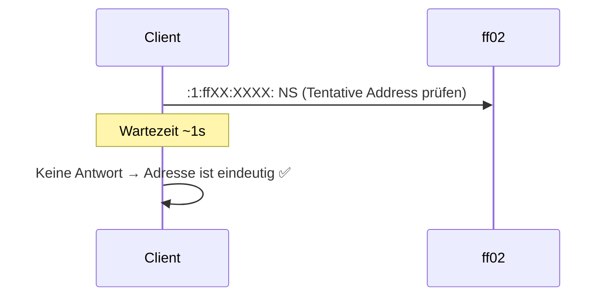
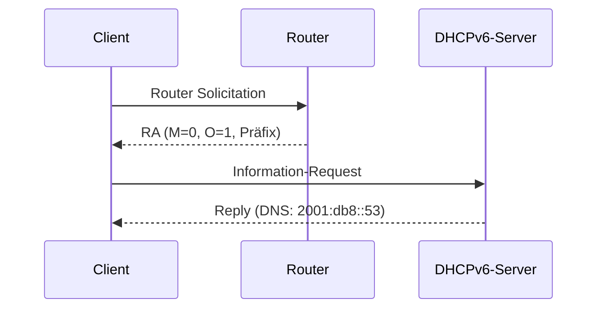
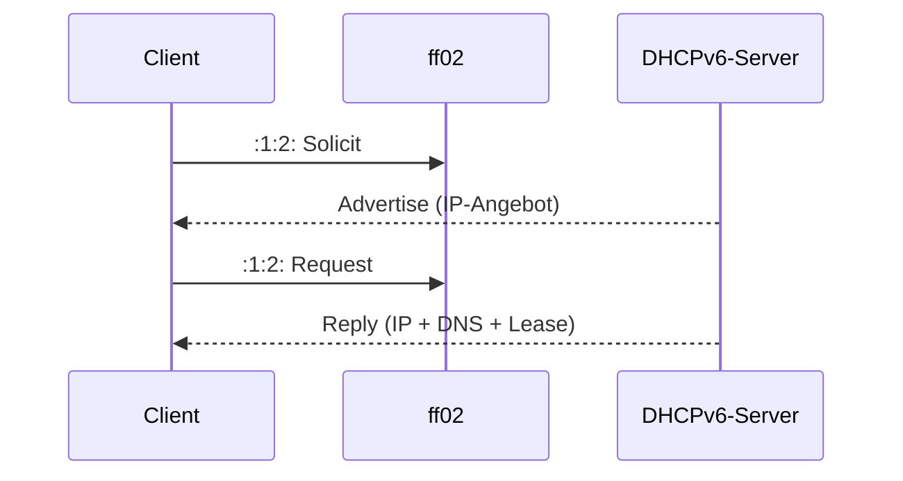

IPv6 kennt drei Mechanismen zur automatischen Adressvergabe – gesteuert durch **Router Advertisement (RA)**-Flags.

## Router Advertisement (RA)

Router senden periodisch oder auf Router Solicitation hin **ICMPv6 RA-Nachrichten** (Typ 134) an `ff02::1` (All Nodes Multicast).

RA enthält:
- Netzwerk-Präfix (z.B. `2001:db8:1::/64`)
- Default-Gateway (Link-Local-Adresse des Routers)
- **M-Flag** und **O-Flag** → steuern Adressvergabeverfahren
- Optional: RDNSS (DNS-Server direkt im RA)

## M- und O-Flag

| M-Flag | O-Flag | Verfahren |
|--------|--------|-----------|
| 0 | 0 | **SLAAC** – Adresse selbst generieren, kein DHCPv6 |
| 0 | 1 | **SLAAC + DHCPv6 stateless** – Adresse via SLAAC, DNS/NTP via DHCPv6 |
| 1 | – | **DHCPv6 stateful** – Adresse und alles via DHCPv6 |

> [!important] **Kernregel**
> Das **Default-Gateway** kommt **immer aus dem RA** – auch bei DHCPv6 stateful. DHCPv6 kann kein Gateway vergeben.

## SLAAC (Stateless Address Autoconfiguration)

RFC 4862 – Client konfiguriert sich vollständig selbst anhand des RA.

**Adressgenerierung:**

```text
Präfix aus RA:  2001:db8:1:: /64
Interface-ID:   aus MAC (EUI-64) oder Privacy Extension (zufällig)

EUI-64 aus MAC 00:1A:2B:3C:4D:5E:
1. 7. Bit flippen: 02:1A:2B:...
2. FF:FE einfügen: 02:1A:2B:FF:FE:3C:4D:5E
→ Interface-ID:   021a:2bff:fe3c:4d5e

Ergebnis: 2001:db8:1::021a:2bff:fe3c:4d5e/64
```

**Privacy Extensions (RFC 4941):** Zufällige Interface-ID statt EUI-64 → verhindert Rückverfolgung anhand der MAC. Standard in modernen Betriebssystemen.

**DAD (Duplicate Address Detection):** Bevor die Adresse genutzt wird, prüft der Client via Neighbor Solicitation, ob die Adresse bereits vergeben ist.



**Vorteil SLAAC:** kein Server nötig, sofort funktionsfähig.  
**Nachteil:** keine zentrale Verwaltung, kein DNS (außer RDNSS im RA).

## DHCPv6 stateless

- **Adresse:** via SLAAC (M=0, O=1)
- **DNS, NTP, Domain:** via DHCPv6-Server
- Server führt **keine Lease-Tabelle**
- Kombination aus Selbstkonfiguration + zentralem DNS



## DHCPv6 stateful

- **Adresse:** via DHCPv6-Server (M=1)
- Server führt **Lease-Tabelle** (wie IPv4-DHCP)
- Kontrolle über Adressvergabe – geeignet für Unternehmensnetze



**DHCPv6-Ports:** UDP **546** (Client) / UDP **547** (Server)  
**DHCPv6-Multicast:** `ff02::1:2` (All DHCP Relay Agents and Servers)

## Vergleich

| Merkmal | SLAAC | DHCPv6 stateless | DHCPv6 stateful |
|---------|-------|------------------|-----------------|
| M-Flag | 0 | 0 | 1 |
| O-Flag | 0 | 1 | – |
| Adresse | selbst | selbst (SLAAC) | DHCPv6-Server |
| Gateway | RA | RA | RA |
| DNS | RDNSS (RA) | DHCPv6 | DHCPv6 |
| Lease-Tabelle | ❌ | ❌ | ✅ |
| Aufwand | minimal | gering | höher |
| Kontrolle | gering | mittel | hoch |

> [!warning] **Achtung Falle**
> Häufigster Fehler: DHCPv6 stateful als alleinige Konfiguration ohne RA → Client bekommt IP, aber **kein Gateway** → kein Routing möglich. RA muss immer aktiv sein.

> [!tip] **Merksatz**
> **M**anaged = DHCPv6 macht alles. **O**ther = nur zusätzliche Infos via DHCPv6. **Gateway immer via RA** – nie via DHCPv6.
