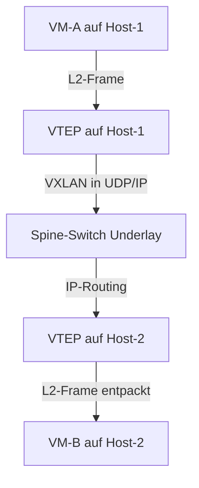

**Underlay** ist das physische Transportnetz. **Overlay** ist ein logisches Netz, das darüber aufgebaut wird – unabhängig von der physischen Topologie.

## Underlay

Das Underlay-Netz besteht aus der realen Infrastruktur: physische Switches, Router, Kabel. Es ist verantwortlich für die **IP-Erreichbarkeit** zwischen allen Endpunkten.

| Merkmal | Details |
|---|---|
| Protokolle | Ethernet, IP, OSPF, BGP, IS-IS |
| Sichtbarkeit | physisch vorhanden, konfiguriert durch Netzadmins |
| Aufgabe | Pakete zwischen VTEPs transportieren |
| Topologie | z.B. Spine & Leaf |

Im RZ-Kontext: Die Spine- und Leaf-Switches bilden das Underlay. Routing läuft per **eBGP** oder **OSPF**.

## Overlay

Das Overlay ist ein **logisches, virtuelles Netz** das über das Underlay gelegt wird. Pakete werden im Underlay als normaler IP-Traffic transportiert, innen steckt aber ein weiterer Frame/Paket (Tunneling).

| Merkmal | Details |
|---|---|
| Protokolle | VXLAN, GRE, GENEVE, IPsec, WireGuard |
| Sichtbarkeit | logisch, konfiguriert in Software |
| Aufgabe | L2-Segmentierung über L3-Underlay, Tenant-Isolation |
| Tunneling | Encapsulation: Original-Paket in UDP/IP eingepackt |

```text
┌─────────────────────────────┐
│  Overlay (logisches Netz)   │
│  VM-A ←──────────────→ VM-B │
│        VXLAN-Tunnel         │
├─────────────────────────────┤
│  Underlay (physisches Netz) │
│  VTEP-1 ←──────────→ VTEP-2│
│       IP-Routing (BGP)      │
└─────────────────────────────┘
```

## Overlay-Protokolle im Vergleich

| Protokoll | Encapsulation | Header-Overhead | Einsatz |
|---|---|---|---|
| **VXLAN** | L2 in UDP/IP | 50 Byte | RZ-Fabrics, VMware NSX |
| **GRE** | IP-in-IP | 24 Byte | WAN-Tunnel, simpel |
| **GENEVE** | L2 in UDP/IP | variabel | Nachfolger VXLAN, flexibler |
| **IPsec** | IP-in-IP (verschl.) | variabel | VPN, Security |
| **WireGuard** | UDP (verschl.) | minimal | modernes VPN |

## Warum Overlay?

**Problem:** Im Rechenzentrum leben VMs/Container in VLANs. VLANs sind auf 4094 begrenzt und schlecht über L3-Grenzen hinweg erweiterbar.

**Lösung:** Overlay-Netze (z.B. VXLAN) ermöglichen:
- Bis zu **16 Mio. logische Segmente** (24-Bit VNI bei VXLAN)
- L2-Adjacency über L3-Underlay (VMs in gleichem VLAN auf verschiedenen physischen Hosts)
- **Tenant-Isolation** in Multi-Tenant-Umgebungen (Cloud)
- Flexibles VM-/Container-Movement ohne Netz-Rekonfiguration

## Zusammenspiel im RZ



> [!tip] **Merksatz**
> Underlay = **Straße** (physisch, IP). Overlay = **Tunnel durch die Straße** (logisch, virtuell). Das Underlay sieht nur äußere IP-Pakete, nicht den Inhalt.

> [!important] **Kernregel**
> Underlay liefert IP-Erreichbarkeit. Overlay nutzt diese für virtuelle L2/L3-Netze. VXLAN ist das dominierende Overlay-Protokoll im modernen RZ.
