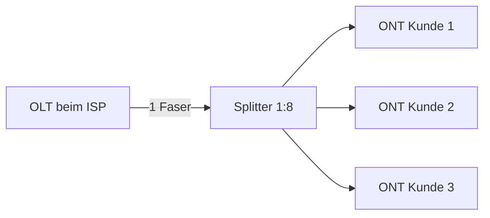

Glasfaser-Zugangsnetze ersetzen zunehmend die Kupfer-Infrastruktur. **FTTx** beschreibt, wie weit die Glasfaser zum Endkunden geführt wird – je weiter, desto höhere Bandbreiten und geringere Latenzen sind möglich.

## FTTx-Topologien

| Kürzel | Bedeutung | Glasfaser bis… | Letzter Abschnitt |
|---|---|---|---|
| FTTN | Fiber to the Node | Kabelverzweiger (~1 km) | Kupfer (VDSL2) |
| FTTCab | Fiber to the Cabinet | Straßenverteiler | Kupfer |
| FTTC | Fiber to the Curb | Bordstein (~100–200 m) | Kupfer (G.fast) |
| FTTBu | Fiber to the Building | Gebäudeeinführung | Kupfer/Koax im Haus |
| FTTB | Fiber to the Basement | Keller des Gebäudes | Kupfer in der Etage |
| FTTH | Fiber to the Home | Wohnungsanschluss | direkt LWL |
| FTTP | Fiber to the Premises | Grundstück/Betrieb | direkt LWL |

> [!tip] **Merksatz**
> Je mehr Buchstaben sich das X mit "Home" teilt, desto weiter kommt die Faser. FTTH = maximal, FTTN = minimal.

## Aktive vs. Passive Netze

| Merkmal | Aktives Netz (AON) | Passives Netz (PON) |
|---|---|---|
| Aktive Komponenten im Feld | Ja (Switches, Verstärker) | Nein |
| Splitter | elektrisch/aktiv | optisch/passiv |
| Strom im Feld nötig | Ja | Nein |
| Wartungsaufwand | höher | geringer |
| Reichweite | ~100 km | ~20–40 km |
| Typischer Einsatz | Metro-Ethernet, P2P-Fiber | FTTH-Massenausbau |

## PON – Passive Optical Network

Ein OLT (Optical Line Terminal) beim Provider versorgt über optische Splitter mehrere ONTs/ONUs beim Kunden – **Point-to-Multipoint** über eine Faser.

**Wellenlängenmultiplex (WDM):**
- Downstream: **1490 nm** (Daten) + 1550 nm (TV optional)
- Upstream: **1310 nm**
- Beide Richtungen über eine Glasfaser – keine Kollisionen, da verschiedene Wellenlängen

**Upstream-Zugriff:** TDMA – jeder ONT sendet in einem zugewiesenen Zeitschlitz (Dynamic Bandwidth Allocation, DBA)

### PON-Standards im Vergleich

| Standard | Downstream | Upstream | Split-Ratio | Bemerkung |
|---|---|---|---|---|
| GPON (G.984) | 2,5 Gbit/s | 1,25 Gbit/s | 1:128 | weit verbreitet |
| XGS-PON (G.9807) | 10 Gbit/s | 10 Gbit/s | 1:128 | symmetrisch, aktuell dominant |
| NG-PON2 (G.989) | 4×10 Gbit/s | 4×2,5 Gbit/s | 1:256 | TWDM-PON |
| 25G-PON | 25 Gbit/s | 25 Gbit/s | – | in Entwicklung |

> [!important] **Kernregel**
> GPON und XGS-PON sind die praxisrelevanten Standards. XGS-PON = symmetrisch 10G, abwärtskompatibel mit GPON-Infrastruktur möglich.

## ONT / ONU / CPE

| Begriff | Bedeutung | Standort |
|---|---|---|
| OLT | Optical Line Terminal | Provider-Seite (CO/POP) |
| ONT | Optical Network Terminal | Beim Endkunden (FTTH) |
| ONU | Optical Network Unit | Im Gebäude (FTTBu/FTTB) |
| CPE | Customer Premises Equipment | Allgemein: Kundenendgerät |

> [!warning] **Achtung Falle**
> ONT ≠ Router. Der ONT wandelt das optische Signal in Ethernet um. Der Router/CPE des Kunden hängt dahinter (oft kombiniert als "ONT-Router-Kombi").
