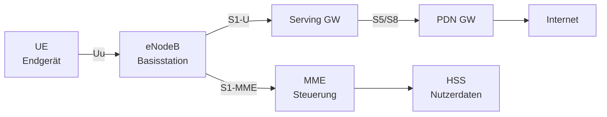

Mobilfunknetze ermöglichen drahtlose WAN-Konnektivität über Funkzellen. Für FiSi relevant: Netzarchitektur, Kennwerte und der Unterschied zwischen den Generationen.

## Generationen-Überblick

| Generation | Standard | Typischer DL | Latenz | Kerntechnologie |
|---|---|---|---|---|
| 2G | GSM / GPRS / EDGE | bis 384 kbit/s | ~300 ms | TDMA |
| 3G | UMTS / HSPA+ | bis 42 Mbit/s | ~50–100 ms | WCDMA |
| 4G | LTE / LTE-A | bis 1 Gbit/s | ~10–30 ms | OFDMA |
| 5G | NR (New Radio) | bis 20 Gbit/s | <1 ms (eMBB) | OFDMA + mmWave |

## 4G – LTE-Architektur (EPC)

LTE trennt Steuerungs- und Nutzdaten konsequent:



| Komponente | Funktion |
|---|---|
| eNodeB (eNB) | Basisstation, übernimmt viele RRM-Funktionen selbst |
| MME | Mobility Management Entity – Signalisierung, Authentifizierung |
| SGW | Serving Gateway – Datenpfad-Ankerpunkt im Heimnetz |
| PGW | PDN Gateway – Übergang ins Internet, IP-Adressvergabe |
| HSS | Home Subscriber Server – Nutzerdatenbank (wie HLR bei 2G/3G) |

> [!tip] **Merksatz**
> LTE = **L**ong **T**erm **E**volution. Das "Long Term" bedeutet: Die Architektur ist auf langfristige Weiterentwicklung ausgelegt → deshalb funktioniert LTE-A (LTE Advanced) auf derselben Infrastruktur.

## LTE-Technologien

**Carrier Aggregation (CA):** Mehrere LTE-Frequenzblöcke werden zu einer logischen Verbindung gebündelt → höhere Datenraten.

**MIMO (Multiple Input Multiple Output):** Mehrere Antennen senden/empfangen gleichzeitig verschiedene Datenströme auf derselben Frequenz → höherer Durchsatz.

**Frequency Division Duplex (FDD) vs. Time Division Duplex (TDD):**

| | FDD | TDD |
|---|---|---|
| Up/Downstream | getrennte Frequenzbänder | gleiches Band, zeitlich getrennt |
| Latenz | niedriger | etwas höher |
| Flexibilität | Up/Down-Verhältnis fest | konfigurierbar |

## 5G – Architektur und Eigenschaften

5G definiert drei Anwendungsklassen:

| Klasse | Kürzel | Ziel | Beispiel |
|---|---|---|---|
| Enhanced Mobile Broadband | eMBB | max. Throughput | Streaming, AR/VR |
| Ultra-Reliable Low Latency | URLLC | <1 ms, >99,999% | Industrie 4.0, Chirurgie |
| Massive Machine Type Comm. | mMTC | viele Geräte, wenig Daten | IoT-Sensornetz |

### Standalone (SA) vs. Non-Standalone (NSA)

| | NSA (Option 3) | SA (Option 2) |
|---|---|---|
| Core | 4G EPC | 5G Core (5GC) |
| Control Plane | 4G (LTE Anker) | 5G NR |
| Vorteil | schneller Rollout | volle 5G-Features (Slicing, URLLC) |
| Nachteil | kein echtes URLLC/Slicing | Infrastrukturaufbau nötig |

> [!important] **Kernregel**
> NSA = 5G-Funk, aber 4G-Core → kein Network Slicing, keine echte URLLC. SA = komplettes 5G-System.

### Network Slicing

Im 5G SA Core können logisch voneinander isolierte Netzscheiben auf derselben physischen Infrastruktur betrieben werden:

```text
Physische Infrastruktur
├── Slice A: eMBB (Smartphones)
├── Slice B: URLLC (Industrieroboter)
└── Slice C: mMTC (Smart Meter)
```

Jeder Slice hat eigene QoS-Parameter, Sicherheitsrichtlinien und Ressourcenkontingente.

### Frequenzbereiche 5G

| Bereich | Frequenz | Reichweite | Durchsatz |
|---|---|---|---|
| Sub-1 GHz (FR1) | 700/800 MHz | sehr groß (Fläche) | gering |
| Mid-Band (FR1) | 3,4–3,8 GHz | mittel | hoch |
| mmWave (FR2) | 26/28 GHz | sehr klein (~100 m) | sehr hoch |

> [!warning] **Achtung Falle**
> mmWave (FR2) hat zwar riesige Bandbreiten, aber die Ausbreitung ist stark durch Gebäude, Regen und sogar Blätter gedämpft – praxisrelevant nur in dicht besiedelten Innenstädten oder Hallen.
