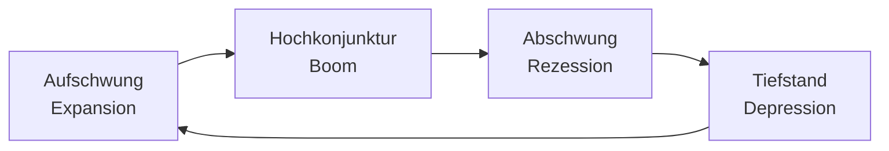

Wirtschaftssystem, das freie Marktwirtschaft (Eigenverantwortung, Wettbewerb) mit sozialen Schutzmaßnahmen des Staates verbindet. Ziel: Wohlstand durch Wettbewerb sichern, soziale Härten abfedern.

---
## Wirtschaftssysteme im Vergleich

| Merkmal | Freie Marktwirtschaft | **Soziale Marktwirtschaft** | Planwirtschaft |
|---|---|---|---|
| Eigentumsordnung | Privat | Privat | Staatlich |
| Preisbildung | Markt | Markt (mit Korrekturen) | Staat |
| Wettbewerb | Uneingeschränkt | Geregelt (Kartellrecht) | Kein Wettbewerb |
| Soziale Sicherung | Keine | Sozialsystem (Rente, Krankenversicherung) | Staatlich garantiert |
| Beispiel | Laissez-faire | Deutschland | DDR, Nordkorea |

> [!important] **Kernregel**
> Soziale Marktwirtschaft = Markt als Steuerungsprinzip + staatliche Rahmenordnung + Sozialstaatsprinzip.

---

## Marktformen

Je nach Anzahl der Anbieter und Nachfrager entstehen unterschiedliche Marktformen:

| Marktform | Anbieter | Nachfrager | Beispiel |
|---|---|---|---|
| **Polypol** | viele | viele | Bäckereigewerbe, Börse |
| **Angebotsoligopol** | wenige | viele | Mineralöl, Automobilhersteller |
| **Angebotsmonopol** | einer | viele | Deutsche Bahn (Schienennetz) |
| **Nachfrageoligopol** | viele | wenige | Rüstungsgüter |
| **Bilaterales Oligopol** | wenige | wenige | – |
| **Bilaterales Monopol** | einer | einer | – |

> [!tip] **Merksatz**
> **Poly** = viele, **Oligo** = wenige, **Mono** = einer. Auf Angebots- oder Nachfrageseite.

Das **Polypol** gilt als ideale Marktform der sozialen Marktwirtschaft: Viele Anbieter konkurrieren, kein einzelner kann den Preis diktieren → beste Versorgung zu niedrigsten Preisen.

---

## Vollkommener Markt – Modellannahmen

Damit ein Polypol als vollkommener Markt funktioniert, müssen gelten:

- **Homogene Güter** – keine objektiven Qualitätsunterschiede
- **Vollständige Markttransparenz** – alle kennen alle Preise
- **Unendlich schnelle Reaktionsfähigkeit** – sofortige Reaktion auf Preisänderungen
- **Keine Präferenzen** – weder räumlich (Nähe), zeitlich (Sofortlieferung) noch persönlich (Sympathie)

In der Realität ist kein Markt vollkommen → **unvollkommener Markt** mit unvollständiger Konkurrenz.

---

## Preisbildung im Polypol (Angebot & Nachfrage)

### Grundprinzip

Der **Gleichgewichtspreis** (auch: Marktpreis) entsteht dort, wo Angebotsmenge = Nachfragemenge. Davon abweichende Preise führen zu Überhängen:

| Situation | Folge |
|---|---|
| Preis > Gleichgewicht | Angebotsüberschuss → Preis sinkt |
| Preis < Gleichgewicht | Nachfrageüberschuss → Preis steigt |

### Preisgesetze

1. Gleichbleibendes Angebot + steigende Nachfrage → **steigende** Preise
2. Gleichbleibendes Angebot + sinkende Nachfrage → **sinkende** Preise
3. Gleichbleibende Nachfrage + steigendes Angebot → **sinkende** Preise
4. Gleichbleibende Nachfrage + sinkendes Angebot → **steigende** Preise

### Beispiel: Polypol an der Börse

An der Börse wird der Gleichgewichtskurs (Einheitskurs) nach dem Meistausführungsprinzip ermittelt: der Kurs, bei dem die **meisten Aufträge ausgeführt** werden (höchster Umsatz).

```text
Mögliche Kurse | Nachfrage | Angebot | realisierte Stücke | Umsatz
56 €           | 230       | 40      | 40                 | 2.240 €
57 €           | 190       | 90      | 90                 | 5.130 €
58 €           | 140       | 140     | 140                | 8.120 €  ← Gleichgewicht
59 €           | 95        | 190     | 95                 | 5.605 €
60 €           | 50        | 240     | 50                 | 3.000 €
```

Bei 58 € wird die höchste Stückzahl (140) und der höchste Umsatz erzielt → Einheitskurs = **58 €**.

> [!tip] **Merksatz**
> Einheitskurs = der Kurs, bei dem Angebot = Nachfrage oder der minimale Überhang vorliegt und der Umsatz maximiert wird.

---

## Oligopol-Preisstrategien

Da wenige Anbieter sich gegenseitig beobachten, gibt es zwei grundlegende Verhaltensweisen:

### Nicht-kooperativ: Verdrängungswettbewerb

Jeder versucht, Marktanteile durch Preissenkung zu gewinnen → **Preisunterbietungsspirale** → Gewinn sinkt bei allen → im Extremfall **ruinöse Konkurrenz** (Preise unter Selbstkosten, bis Konkurrenten ausscheiden).

### Kooperativ: Preisführerschaft & Kartell

- **Preisführerschaft:** Ein Anbieter ändert den Preis, andere folgen (Parallelverhalten). Nicht verboten, aber wettbewerbsbeschränkend.
- **Preisabsprache (Kartell):** Vertragliche Vereinbarung über Preise/Mengen (Preiskartell, Quotenkartell). **Verboten** nach GWB (Gesetz gegen Wettbewerbsbeschränkungen) → Bundeskartellamt überwacht.
- **„Frühstückskartell":** Abgestimmtes Verhalten ohne Vertrag – ebenfalls verboten.

> [!warning] **Achtung Falle**
> Preisführerschaft = legal (Parallelverhalten ohne Absprache). Preiskartell = illegal. Der Unterschied liegt in der **vertraglichen oder abgestimmten Vereinbarung**.

---

## Staatliche Eingriffe in die Preisbildung

Der Staat greift ein, um bestimmte Anbieter oder Nachfrager zu schützen.

### Indirekte / marktkonforme Maßnahmen (Preislenkung)

Beeinflussen Angebot/Nachfrage, ohne den Marktpreis direkt zu setzen:

- Einfuhrzölle (schützen inländische Hersteller)
- Subventionen (z. B. Steinkohlenbergbau)
- Exportförderung (Exportprämien, Steuervergünstigungen)
- Einfuhrkontingente

### Direkte / marktkonträre Eingriffe (Preisbindung)

| Eingriff | Lage | Wirkung | Folge |
|---|---|---|---|
| **Höchstpreis** (P_max) | unterhalb Gleichgewichtspreis | soll Verbraucher schützen | Nachfrageüberschuss → Schwarzmarkt |
| **Mindestpreis** (P_min) | oberhalb Gleichgewichtspreis | soll Hersteller schützen | Angebotsüberschuss → „Butterberg" |
| **Preisstopp** | aktueller Preis eingefroren | allgemeiner Inflationsschutz | Marktverzerrung |

> [!important] **Kernregel**
> Höchstpreis **unter** Gleichgewicht → Nachfrageüberschuss (zu wenig Angebot).
> Mindestpreis **über** Gleichgewicht → Angebotsüberschuss (zu viel Angebot).

---

## Bruttoinlandsprodukt (BIP)

Das BIP misst den **Gesamtwert aller Waren und Dienstleistungen**, die in einem Land innerhalb eines Jahres produziert werden.

| | Nominales BIP | Reales BIP |
|---|---|---|
| Bewertung | zu aktuellen Marktpreisen | inflationsbereinigt (zu Preisen des Basisjahres) |
| Aussage | absoluter Geldwert | tatsächliches Wirtschaftswachstum |
| Problem | enthält Preissteigerungen | – |

```text
Reales BIP = (Nominales BIP / Preisindex) × 100
```

### BIP als Wohlstandsindikator – Grenzen

Das BIP ist **kein** vollständiger Wohlstandsindikator, weil:
- **Unbezahlte Arbeit** (Hausarbeit, Ehrenamt) nicht erfasst wird
- **Umweltzerstörung** durch Produktion nicht abgezogen wird
- **Verteilung** des Wohlstands nicht sichtbar ist (hohes BIP trotz Armut möglich)
- **Schattenwirtschaft** nicht enthalten ist

> [!tip] **Merksatz**
> BIP = **Wie viel produziert wird** – nicht wie gut es den Menschen geht.

---

## Konjunkturzyklus

Die Wirtschaft verläuft in wiederkehrenden Phasen (idealtypisch):



| Phase | Merkmale |
|---|---|
| **Aufschwung** | BIP steigt, Aufträge nehmen zu, Investitionen steigen |
| **Hochkonjunktur** | Vollbeschäftigung, Kapazitäten ausgelastet, Wirtschaftszweige suchen Mitarbeiter |
| **Abschwung / Rezession** | BIP sinkt (2 Quartale in Folge negativ), Auftragsbücher leeren sich, Entlassungen |
| **Tiefstand / Depression** | Hohe Arbeitslosigkeit, niedrige Investitionen, Talsohle |

> [!warning] **Achtung Falle**
> **Rezession** = offiziell erst bei **zwei aufeinanderfolgenden Quartalen** mit negativem BIP-Wachstum.

### Konjunkturpolitische Maßnahmen des Staates

Bei sinkendem BIP (Abschwung) kann der Staat gegensteuern:

- **Expansive Fiskalpolitik:** Erhöhung der Staatsausgaben (Infrastruktur, Investitionen) oder Steuersenkungen → Nachfrage steigt
- **Expansive Geldpolitik (EZB):** Leitzinssenkung → Kredite günstiger → mehr Investitionen

Ziel: BIP-Wachstum wieder ankurbeln, Arbeitslosigkeit bekämpfen.

---

## Preisindex & Warenkorb

### Verbraucherpreisindex (VPI)

Misst die durchschnittliche Preisentwicklung für einen **typischen Warenkorb** privater Haushalte. Basis: Statistisches Bundesamt mit 700 Waren und Dienstleistungen in 12 Hauptgruppen (Nahrungsmittel, Wohnen, Verkehr, Gesundheit usw.).

Gewichtung = Anteil am durchschnittlichen Haushaltsbudget (z. B. Wohnen ≈ 1/3 → hohe Gewichtung). Anpassung alle **5 Jahre** an veränderte Konsumgewohnheiten.

### Berechnung

```text
Preisindex = (Wert des Warenkorbs im Berichtsjahr / Wert des Warenkorbs im Basisjahr) × 100

Inflationsrate = ((Preisindex Jahr 2 - Preisindex Jahr 1) / Preisindex Jahr 1) × 100
```

**Beispiel:**

| | Basisjahr | Jahr 02 | Jahr 03 |
|---|---|---|---|
| Wert Warenkorb | 650 € | 700 € | 880 € |
| VPI | 100 | 107,7 | 135,4 |
| Inflationsrate | – | 7,7 % | 25,7 % |

---

## Inflation

**Definition:** Anhaltender Anstieg des allgemeinen Preisniveaus = Kaufkraftverlust des Geldes.

### Ursachen

| Art | Ursache |
|---|---|
| **Nachfrageinflation** | Nachfrage übersteigt Angebot (z. B. starke Konsumausgaben, staatliche Konjunkturprogramme) |
| **Angebotsinflation / Kostendruckinflation** | Steigende Produktionskosten (Rohstoffe, Löhne) → Unternehmen erhöhen Preise |
| **Importierte Inflation** | Steigende Importpreise (Energie, Rohstoffe) treiben inländische Preise |
| **Geldmengeninflation** | Zu viel Geld im Umlauf bei gleichem Güterangebot (Quantitätstheorie) |
| **Gewinndruckinflation** | Marktbeherrschende Unternehmen erhöhen Preise zur Gewinnsteigerung |

> [!tip] **Merksatz**
> **Nachfrage-Pull** (Nachfrage zieht Preise hoch) vs. **Cost-Push** (Kosten drücken Preise hoch).

### Lohn-Preis-Spirale

```text
Inflation steigt → Gewerkschaften fordern höhere Löhne
→ Unternehmen erhöhen Preise (Kostenausgleich)
→ Inflation steigt weiter → nächste Lohnrunde ...
```

Wer die Spirale startet (Löhne oder Preise), ist empirisch nicht eindeutig beweisbar.

### Folgen der Inflation

| Betroffene | Auswirkung |
|---|---|
| **Arbeitnehmer** | Reallohn sinkt (Nominallohn − Inflationsrate = Reallohn); Kaufkraftverlust |
| **Geldvermögen** | Realwert sinkt, wenn Zinsen < Inflationsrate |
| **Sachwerte** | Relative Aufwertung (Immobilien, Gold) |
| **Schuldner** | Profitieren – Schulden verlieren real an Wert |
| **Gläubiger** | Verlieren – Forderungen verlieren real an Wert |
| **Staat** | Steuereinnahmen steigen nominal (kalte Progression) |

> [!warning] **Achtung Falle**
> **Nominallohn** = absoluter Geldbetrag. **Reallohn** = Kaufkraft (nominaler Lohn bereinigt um Inflation). Bei 5 % Lohnerhöhung und 8 % Inflation → Reallohn sinkt um ~3 %.
