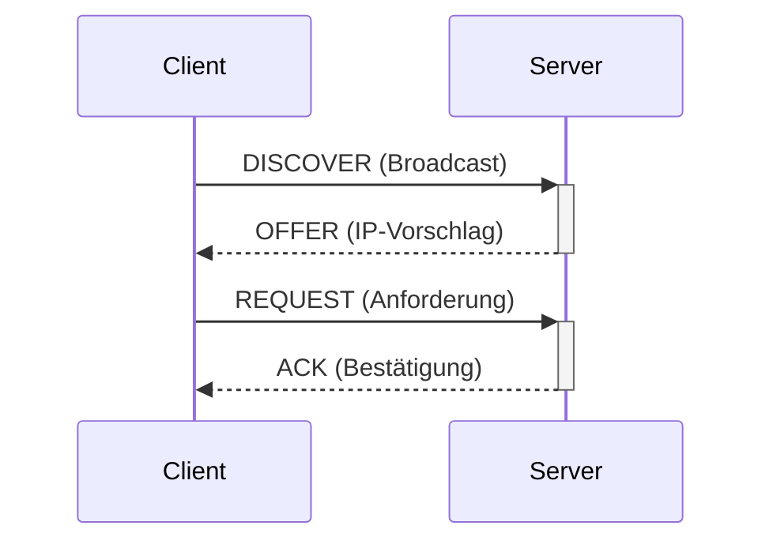

[[Netzwerkmanagement|zurück]]

---

# Adressvergabe IPv4 & IPv6

Überblick über alle Methoden zur IP-Adressvergabe – statisch, dynamisch und automatisch – für IPv4 und IPv6.

## IPv4 Adressvergabe

### Statisch

Administrator trägt IP-Adresse, Subnetzmaske, Gateway und DNS manuell ein.

**Wann:** Server, Drucker, Netzwerkgeräte – alles was eine feste Adresse braucht.

```text
IP-Adresse:    192.168.1.10
Subnetzmaske:  255.255.255.0
Gateway:       192.168.1.1
DNS:           192.168.1.53
```

### DHCP (Dynamic Host Configuration Protocol)

Automatische Adressvergabe an Clients – Standard für Endgeräte.

**DORA-Ablauf:**


| Phase | Typ | Inhalt |
|-------|-----|--------|
| **D**ISCOVER | Broadcast | Client sucht DHCP-Server |
| **O**FFER | Unicast/Broadcast | Server bietet IP an |
| **R**EQUEST | Broadcast | Client fordert angebotene IP an |
| **A**CK | Unicast/Broadcast | Server bestätigt, liefert Lease-Time |

**DHCP liefert:** IP, Maske, Gateway, DNS, Lease-Time, NTP-Server (optional)

**DHCP-Relay (IP Helper):** Bei getrennten Netzen leitet ein Router DHCP-Broadcasts an den Server weiter:
```bash
# Cisco Router Interface
interface GigabitEthernet0/1
 ip helper-address 10.0.0.10    ← DHCP-Server-IP
```

## IPv6 Adressvergabe

IPv6 bietet **drei Methoden** – oft kombinierbar:

| Methode | Adresse | Gateway | DNS | Zustandsbehaftet? |
|---------|---------|---------|-----|-------------------|
| **Statisch** | manuell | manuell | manuell | – |
| **SLAAC** | automatisch (EUI-64/Random) | via RA | ❌ (nur via RDNSS) | ❌ stateless |
| **DHCPv6 stateless** | via SLAAC | via RA | via DHCPv6 | ❌ stateless |
| **DHCPv6 stateful** | via DHCPv6 | via RA | via DHCPv6 | ✅ stateful |

> [!important] **Kernregel**
> Das Gateway kommt bei IPv6 **immer** aus dem **Router Advertisement (RA)** – auch bei DHCPv6 stateful! DHCPv6 allein kann kein Gateway vergeben.

### SLAAC (Stateless Address Autoconfiguration)

Der Router sendet periodisch **Router Advertisements (RA)** mit dem Netz-Präfix. Der Client generiert die Interface-ID selbst:

**EUI-64-Verfahren:** MAC-Adresse (48 Bit) → 7. Bit flippen, `FF:FE` einfügen → 64 Bit Interface-ID

```text
MAC:  00:1A:2B:3C:4D:5E
EUI-64: 021A:2BFF:FE3C:4D5E
IPv6: 2001:db8:1::/64 + 021A:2BFF:FE3C:4D5E
    = 2001:db8:1::021a:2bff:fe3c:4d5e
```

**Privacy Extensions (RFC 4941):** Zufällige Interface-ID statt EUI-64 → verhindert Tracking anhand der MAC.

**RA-Flags steuern das Verhalten:**

| Flag | Name | Bedeutung |
|------|------|-----------|
| **M** | Managed | = 1 → DHCPv6 stateful für Adresse nutzen |
| **O** | Other | = 1 → DHCPv6 für andere Infos (DNS etc.) |
| M=0, O=0 | – | nur SLAAC |
| M=0, O=1 | – | SLAAC + DHCPv6 stateless |
| M=1 | – | DHCPv6 stateful |

### DHCPv6

**Stateless DHCPv6:** SLAAC macht die Adresse, DHCPv6 liefert nur DNS/NTP.

**Stateful DHCPv6:** DHCPv6-Server vergibt Adressen und führt eine Lease-Tabelle (wie DHCP bei IPv4).

```text
[Client] --Solicit--> [DHCPv6-Server]
         <-Advertise-
         --Request-->
         <-Reply-----
```

DHCPv6 läuft über **UDP 546** (Client) und **UDP 547** (Server).

> [!tip] **Merksatz**
> **SLAAC** = selbst konfigurieren anhand RA, **DHCPv6** = Server verwaltet Adressen, **Gateway immer via RA**.

> [!warning] **Achtung Falle**
> Viele verwechseln DHCPv6 mit IPv4-DHCP – **DHCPv6 überträgt kein Default-Gateway**. Der Client lernt den Router-Link-Local über RA (ICMPv6 Router Advertisement).
