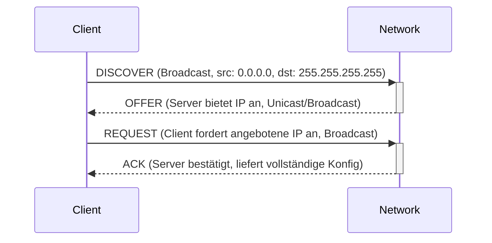

[[Netzwerkdienste|zurück]]

---

# DHCP – Dynamic Host Configuration Protocol

DHCP vergibt automatisch IP-Adressen und Netzwerkkonfiguration an Clients. Läuft über **UDP 67** (Server) / **UDP 68** (Client).

## DORA-Prinzip

Der vierstu­fige Ablauf der IP-Adressvergabe:



| Phase | Richtung | Typ | Inhalt |
|-------|----------|-----|--------|
| **D**ISCOVER | Client → Broadcast | Broadcast | Wer ist DHCP-Server? |
| **O**FFER | Server → Client | Unicast/Broadcast | Angebot: IP, Lease-Time |
| **R**EQUEST | Client → Broadcast | Broadcast | Anforderung der angebotenen IP |
| **A**CK | Server → Client | Unicast/Broadcast | Bestätigung + vollständige Konfiguration |

> [!tip] **Merksatz**
> **D**er **O**lle **R**outer **A**ntwortet – DISCOVER, OFFER, REQUEST, ACK

**DHCP liefert:**
- IP-Adresse + Subnetzmaske
- Default-Gateway
- DNS-Server
- Lease-Time (wie lange die IP gültig ist)
- Optional: NTP-Server, TFTP-Server, Domain-Name

## Lease-Mechanismus

```text
Lease-Time: 8 Stunden (Beispiel)

t=0h    → IP vergeben
t=4h    → Client sendet REQUEST zur Verlängerung (50% der Lease-Time)
t=7h    → erneuter Versuch (87,5%)
t=8h    → Lease abgelaufen → IP freigegeben
```

## DHCP-Relay (IP Helper Address)

DHCP nutzt Broadcasts – Broadcasts überwinden keine Router-Grenzen. Bei getrennten Netzen benötigt man einen **DHCP-Relay-Agent**.

```text
[Client Netz A]──DISCOVER Broadcast──►[Router]──Unicast──►[DHCP-Server Netz B]
                                       Relay-Agent
```

Der Router nimmt den Broadcast entgegen, wandelt ihn in Unicast um und leitet ihn an den DHCP-Server weiter. Die Antwort läuft zurück über den Router zum Client.

**Cisco Konfiguration:**
```bash
interface GigabitEthernet0/1
 ip address 192.168.1.1 255.255.255.0
 ip helper-address 10.0.0.10     ← DHCP-Server-IP
```

## DHCP-Server konfigurieren (Linux / ISC DHCP)

```bash
# /etc/dhcp/dhcpd.conf
subnet 192.168.1.0 netmask 255.255.255.0 {
    range 192.168.1.100 192.168.1.200;
    option routers 192.168.1.1;
    option domain-name-servers 192.168.1.53;
    default-lease-time 3600;
    max-lease-time 86400;
}

# Statische Bindung (MAC → IP)
host drucker01 {
    hardware ethernet 00:1A:2B:3C:4D:5E;
    fixed-address 192.168.1.50;
}
```

## DHCP-Sicherheit

| Angriff | Beschreibung | Gegenmaßnahme |
|---------|-------------|--------------|
| **DHCP Starvation** | Angreifer erschöpft den IP-Pool mit vielen DISCOVER | DHCP Snooping, Rate-Limiting |
| **Rogue DHCP Server** | Angreifer betreibt eigenen DHCP-Server → falsche Gateway/DNS | DHCP Snooping (nur Trusted Ports) |
| **DHCP Snooping** | Switch filtert DHCP-Traffic – nur vertrauenswürdige Ports dürfen OFFER senden | ✅ aktivieren |

> [!important] **Kernregel**
> DHCP-Traffic ist **Broadcast** (Client hat noch keine IP) → UDP 68 → UDP 67. Relay überwindet Broadcast-Grenzen via Unicast.

> [!warning] **Achtung Falle**
> DISCOVER und REQUEST sind **Broadcasts** (auch wenn die IP schon angeboten wurde) – der Client sendet REQUEST als Broadcast, damit alle DHCP-Server wissen, wessen Angebot akzeptiert wurde (andere ziehen ihr OFFER zurück).
