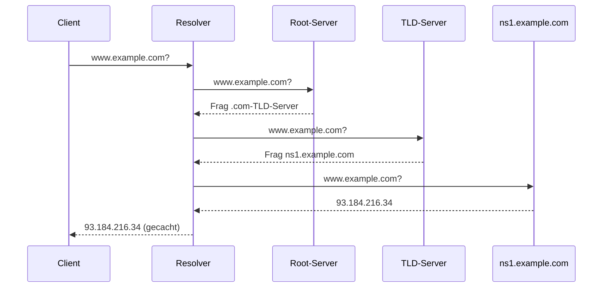

[[Netzwerkdienste|zurück]]

---

# DNS – Domain Name System

DNS übersetzt **Domainnamen in IP-Adressen** (und umgekehrt) – das „Telefonbuch" des Internets. Läuft über **UDP/TCP Port 53**.

## Hierarchie des DNS

```text
.                          ← Root (13 Root-Server weltweit)
├── com.
│   └── example.com.       ← Second-Level Domain (SLD)
│       └── www.example.com.  ← Subdomain / Hostname
├── de.
└── org.
```

- **Root-Zone (`.`):** 13 Root-Server-Cluster (a.root-servers.net bis m.)
- **TLD (Top-Level Domain):** `.com`, `.de`, `.org` – verwaltet von IANA/Registries
- **SLD:** Registrierte Domain (z.B. `example.com`)
- **Subdomain:** frei vergebar durch Domain-Inhaber (z.B. `www`, `mail`, `vpn`)

## DNS-Auflösung (iterativ)



- **Stub Resolver:** minimaler Client im Betriebssystem
- **Rekursiver Resolver (Caching NS):** fragt die gesamte Kette ab, cacht Ergebnisse (ISP, 8.8.8.8, 1.1.1.1)
- **Autoritativer NS:** kennt die tatsächlichen Einträge der Zone (antwortet final)

## DNS-Record-Typen

| Typ | Bedeutung | Beispiel |
|-----|-----------|---------|
| **A** | IPv4-Adresse | `www.example.com → 93.184.216.34` |
| **AAAA** | IPv6-Adresse | `www.example.com → 2606:2800::/32` |
| **CNAME** | Alias auf anderen Hostnamen | `ftp.example.com → www.example.com` |
| **MX** | Mailserver für Domain | `example.com → mail.example.com (Prio 10)` |
| **NS** | Nameserver der Zone | `example.com → ns1.example.com` |
| **PTR** | Reverse-DNS (IP → Name) | `34.216.184.93.in-addr.arpa → www.example.com` |
| **TXT** | Freitext (SPF, DKIM, DMARC) | `"v=spf1 mx -all"` |
| **SOA** | Start of Authority (Zone-Metadaten) | Serial, Refresh, Retry, Expire |
| **SRV** | Service-Locator | `_sip._tcp.example.com` |

## TTL (Time to Live)

Gibt an, wie lange ein Eintrag gecacht werden darf (in Sekunden).
- Kurze TTL (300 s): schnelle DNS-Änderungen möglich, mehr Anfragen
- Lange TTL (86400 s = 1 Tag): weniger Traffic, Änderungen dauern

> [!warning] **Achtung Falle**
> DNS nutzt standardmäßig **UDP 53** (schnell, kein Handshake). Bei Antworten > 512 Byte (oder mit EDNS0 > 4096 Byte) wird auf **TCP 53** gewechselt. DNS over TLS (DoT) nutzt TCP **853**.

## Reverse-DNS (PTR)

IP-Adresse → Hostname. Wichtig für Mailserver (Anti-Spam) und Logging.

```text
PTR-Anfrage: 34.216.184.93.in-addr.arpa
Antwort:     www.example.com

# IPv6 Reverse: nibble-weise, umgekehrt
IP:  2001:db8::1
PTR: 1.0.0.0.0.0.0.0.0.0.0.0.0.0.0.0.0.0.0.0.0.0.0.0.8.b.d.0.1.0.0.2.ip6.arpa
```

## DNS-Sicherheit

| Methode | Beschreibung |
|---------|-------------|
| **DNSSEC** | Kryptografische Signierung von DNS-Antworten – verhindert Cache Poisoning |
| **DNS over TLS (DoT)** | Verschlüsselung via TLS, Port 853 |
| **DNS over HTTPS (DoH)** | DNS-Anfragen über HTTPS (Port 443) – schwer zu filtern |

> [!important] **Kernregel**
> DNS-Auflösung ist **iterativ** (Resolver fragt selbst weiter) oder **rekursiv** (Server fragt für den Client). Standard-Resolver beim Client = rekursiv zum Caching-NS.

> [!tip] **Merksatz**
> A=IPv4, AAAA=IPv6, MX=Mail, CNAME=Alias, PTR=Reverse, NS=Nameserver. **UDP 53** Standard, **TCP 53** große Antworten, **853** DoT.

## Split-DNS (Split-Horizon DNS)

Split-DNS liefert **unterschiedliche DNS-Antworten** je nach Herkunft der Anfrage – interne Clients sehen andere IPs als externe Clients.

```text
Interne Anfrage (aus dem LAN):
  Client → interner DNS → mail.firma.de → 192.168.1.10  (private IP)

Externe Anfrage (aus dem Internet):
  Client → öffentlicher DNS → mail.firma.de → 91.12.50.1  (öffentliche IP)
```

**Warum?** Ein interner Client der `mail.firma.de` auflöst, soll direkt die interne IP bekommen – nicht über Internet und zurück (Hairpin/NAT-Loopback-Problem). Externe Clients bekommen die öffentliche Firewall-/DMZ-IP.

**Umsetzung:**

| Variante | Beschreibung |
|---|---|
| **Zwei getrennte DNS-Server** | Interner DNS nur für LAN erreichbar, externer DNS öffentlich – beide haben eigene Zone für `firma.de` |
| **Ein DNS-Server mit Views** | z.B. BIND: antwortet je nach Quell-IP mit unterschiedlichen Zonendaten (`view intern / view extern`) |

**Typische Anwendungsfälle:**
- Mailserver intern direkt erreichbar, extern über DMZ-Firewall
- VPN-Gateway: intern andere IP als außen
- Testumgebung: intern → Testserver, extern → Produktivsystem

> [!warning] **Achtung Falle**
> Interner DNS-Server braucht einen **Forwarder** für externe Domains (z.B. 8.8.8.8), sonst können interne Clients nichts im Internet auflösen. Außerdem: interne Clients dürfen **nicht** den externen DNS befragen – sonst bekommen sie die falsche (öffentliche) IP für interne Server und können diese nicht erreichen.

> [!tip] **Merksatz**
> Split-DNS = **doppeltes Telefonbuch** – intern andere Nummer als außen. Gleicher Domainname, unterschiedliche IP je nach Standort des Fragenden.
