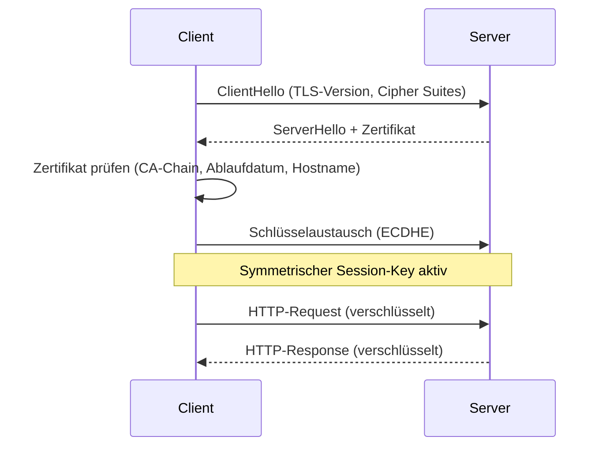

[[Netzwerkdienste|zurück]]

---

# HTTP & HTTPS

HTTP (Hypertext Transfer Protocol) ist das Fundament der Web-Kommunikation – HTTPS ergänzt es um TLS-Verschlüsselung.

## HTTP-Grundlagen

- **Port:** TCP **80**
- **Transport:** TCP (zuverlässig)
- **Stateless:** Server speichert keinen Zustand zwischen Anfragen (Sessions via Cookies)
- **RFC:** 7230 ff.

**Request-Response-Modell:**
```text
Client                          Server
  │── GET /index.html HTTP/1.1 ──►│
  │   Host: example.com           │
  │◄── HTTP/1.1 200 OK ───────────│
  │    Content-Type: text/html    │
  │    <html>...</html>           │
```

## HTTP-Methoden

| Methode | Beschreibung | Body? | Idempotent? |
|---------|-------------|-------|-------------|
| GET | Ressource laden | ❌ | ✅ |
| POST | Daten senden (Formular, API) | ✅ | ❌ |
| PUT | Ressource ersetzen | ✅ | ✅ |
| PATCH | Ressource teilweise ändern | ✅ | ❌ |
| DELETE | Ressource löschen | ❌ | ✅ |
| HEAD | Wie GET, nur Header | ❌ | ✅ |
| OPTIONS | Verfügbare Methoden abfragen | ❌ | ✅ |

## HTTP-Statuscodes

| Bereich | Kategorie | Wichtige Codes |
|---------|-----------|---------------|
| 1xx | Informational | 100 Continue |
| 2xx | Success | 200 OK, 201 Created, 204 No Content |
| 3xx | Redirection | 301 Moved Permanently, 302 Found, 304 Not Modified |
| 4xx | Client Error | 400 Bad Request, 401 Unauthorized, 403 Forbidden, 404 Not Found |
| 5xx | Server Error | 500 Internal Server Error, 502 Bad Gateway, 503 Service Unavailable |

## HTTP-Versionen

| Version | Merkmal |
|---------|---------|
| HTTP/1.0 | eine Verbindung pro Request |
| HTTP/1.1 | Keep-Alive (persistent), Pipelining, Host-Header (Pflicht) |
| HTTP/2 | Binary statt Text, Multiplexing (mehrere Streams), Header-Komprimierung (HPACK) |
| HTTP/3 | basiert auf QUIC (UDP statt TCP), noch schnellerer Verbindungsaufbau |

## HTTPS (HTTP Secure)

- **Port:** TCP **443**
- **Verschlüsselung:** TLS (Transport Layer Security)
- HTTP läuft unverändert – TLS bildet einen verschlüsselten Tunnel darunter

**TLS-Handshake (vereinfacht):**


**Zertifikat:** Bindet öffentlichen Schlüssel an Domain – signiert von einer CA (Certificate Authority). Browser prüft:
1. Signatur gültig (vertrauenswürdige CA)?
2. Hostname stimmt überein?
3. Gültigkeitszeitraum nicht abgelaufen?

## HTTP vs. HTTPS

| Merkmal | HTTP | HTTPS |
|---------|------|-------|
| Port | 80 | 443 |
| Verschlüsselung | ❌ | ✅ TLS |
| Datenintegrität | ❌ | ✅ |
| Authentifizierung Server | ❌ | ✅ (Zertifikat) |
| SEO / Browser | ⚠️ "Nicht sicher" | ✅ |
| Performance | minimal besser | marginal schlechter (Handshake einmalig) |

## HSTS (HTTP Strict Transport Security)

Server sendet Header: `Strict-Transport-Security: max-age=31536000`
→ Browser erzwingt für die Domain automatisch HTTPS (kein Downgrade auf HTTP möglich).

> [!important] **Kernregel**
> HTTP überträgt alles im Klartext – Passwörter, Cookies, Inhalte sind für jeden im Netz lesbar. **HTTPS ist Pflicht**, nicht optional.

> [!warning] **Achtung Falle**
> HTTP/2 und HTTP/3 sind **nicht dasselbe wie HTTPS** – die Versionsnummer beschreibt die Protokolleffizienz, nicht die Verschlüsselung. HTTP/2 kann theoretisch auch unverschlüsselt laufen (h2c), wird aber in der Praxis nie so eingesetzt.

> [!tip] **Merksatz**
> **80** = HTTP plain, **443** = HTTPS (TLS). Statuscodes: **2xx** gut, **3xx** Umleitung, **4xx** dein Fehler, **5xx** Server-Fehler.

## Web-Proxy

Ein **Web-Proxy** ist ein zwischengeschalteter Server, der HTTP/HTTPS-Anfragen im Namen der Clients stellt.

```text
Client (RFC-1918) ──► Proxy-Server ──► Internet
  10.0.0.5              91.12.1.1        Server
```

**Warum braucht man einen Proxy?**

Clients im internen Netz haben private IP-Adressen (RFC 1918: `10.x`, `172.16-31.x`, `192.168.x`). Diese Adressen sind im Internet **nicht routbar** – ein direktes Paket vom Client käme nie zurück, weil der Zielserver nicht antworten kann (er wüsste nicht, wohin). Der Proxy besitzt eine öffentliche IP und kommuniziert stellvertretend.

> [!important] **Kernregel**
> Ohne Proxy (und ohne NAT): Client mit RFC-1918-Adresse kann nicht direkt mit dem Internet kommunizieren – Antwortpakete finden keinen Weg zurück. Proxy (oder NAT) ist zwingend notwendig.

**Funktionsweise:**
1. Client sendet Anfrage an Proxy (nicht direkt an Zielserver)
2. Proxy prüft Filterregeln (URL-Blacklist, Kategorien, Nutzerrechte)
3. Proxy stellt Anfrage im eigenen Namen an Zielserver
4. Proxy empfängt Antwort, cached sie optional
5. Proxy liefert Antwort an Client zurück

**Vorteile / Funktionen:**

| Funktion | Beschreibung |
|---|---|
| **Caching** | Häufig abgerufene Inhalte werden lokal gespeichert → schnellere Antwort, weniger Bandbreite |
| **Filterung** | URLs, Kategorien, Domains sperren (Jugendschutz, Sicherheitsrichtlinien) |
| **Anonymisierung** | Zielserver sieht nur Proxy-IP, nicht Client-IP |
| **Logging** | Vollständige Protokollierung des Web-Zugriffs pro Nutzer |
| **Authentifizierung** | Nutzer müssen sich am Proxy anmelden (NTLM, Kerberos) |
| **Contentprüfung** | SSL Inspection (HTTPS-Entschlüsselung für Virenscanner) |

**Proxy vs. NAT:**

| | NAT (auf Router/Firewall) | Web-Proxy |
|---|---|---|
| Layer | L3/L4 (IP/Port-Übersetzung) | L7 (Anwendungsebene) |
| Protokolle | alle TCP/UDP | meist nur HTTP/HTTPS |
| Filterung | nein | ja (URL, Kategorie, Inhalt) |
| Caching | nein | ja |
| Transparenz | für Client unsichtbar | Client muss Proxy konfigurieren (oder Transparent Proxy) |

> [!tip] **Merksatz**
> Proxy = **Stellvertreter auf Anwendungsebene**. NAT = **Adressübersetzung auf Netzwerkebene**. In der Praxis oft beide parallel: NAT für allgemeinen Traffic, Proxy für HTTP/HTTPS mit Filterung und Logging.

## Reverse Proxy

Ein **Reverse Proxy** sitzt vor Servern (nicht vor Clients) und nimmt Anfragen aus dem Internet entgegen, die er an interne Server weiterleitet.

```text
Internet-Client ──► Reverse Proxy ──► interner Web-Server 1
                         │         ──► interner Web-Server 2
                         │         ──► interner Web-Server 3
```

**Unterschied Forward Proxy vs. Reverse Proxy:**

| | Forward Proxy (Web-Proxy) | Reverse Proxy |
|---|---|---|
| **Schützt** | den Client (intern) | den Server (intern) |
| **Sicht des Zielservers** | sieht Proxy-IP, nicht Client | sieht Proxy-IP, nicht interner Server |
| **Typischer Einsatz** | Unternehmen → Internet (Filterung, Caching) | Internet → Unternehmen (DMZ, Load Balancing) |
| **Konfiguration** | Client muss Proxy kennen | Client kennt nur Reverse-Proxy-IP |

**Aufgaben eines Reverse Proxys:**

| Funktion | Beschreibung |
|---|---|
| **Load Balancing** | Anfragen auf mehrere Backend-Server verteilen (Round Robin, IP-Hashing) |
| **SSL-Termination** | TLS-Verschlüsselung am Proxy beenden → Backend kommuniziert unverschlüsselt intern |
| **Caching** | Statische Inhalte zwischenspeichern → Backend entlasten |
| **Schutz** | Backend-IP bleibt verborgen, DDoS-Abwehr, WAF (Web Application Firewall) |
| **Komprimierung** | Antworten komprimieren (gzip) bevor sie zum Client gehen |
| **Authentifizierung** | Zentrale Auth-Schicht vor mehreren Backend-Diensten |

**Typische Produkte:** nginx, HAProxy, Apache (mod_proxy), Cloudflare, AWS ALB

> [!important] **Kernregel**
> Reverse Proxy = **Schutzschild vor dem Server**. Der Client weiß nicht, welcher (oder wie viele) Backend-Server hinter dem Proxy stehen. Bei SSL-Termination: HTTPS außen, HTTP innen (im internen Netz).

> [!tip] **Merksatz**
> Forward Proxy: Client → Proxy → Internet (**Client versteckt sich**). Reverse Proxy: Internet → Proxy → Server (**Server versteckt sich**).
