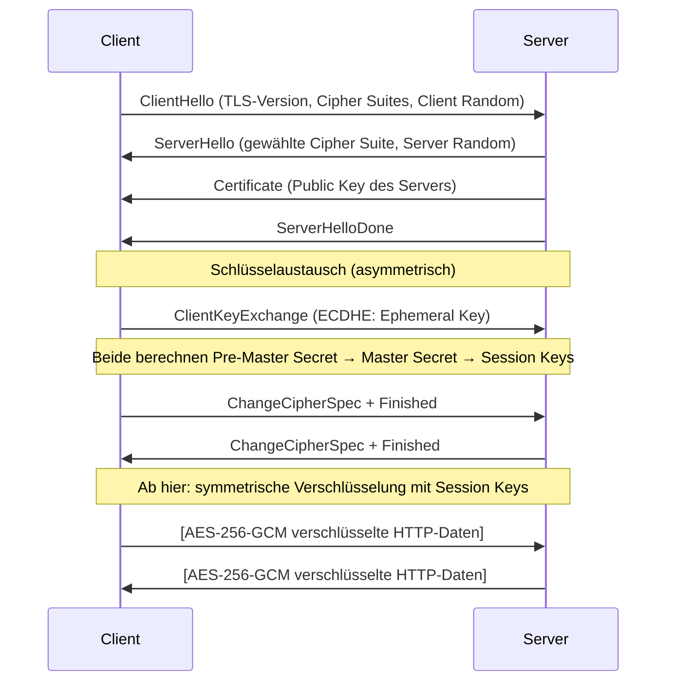

[[Sicherheit|zurück]]

---

# Hybride Verfahren

Hybride Kryptografie kombiniert **asymmetrische Verfahren für den Schlüsselaustausch** mit **symmetrischen Verfahren für die eigentliche Datenverschlüsselung** – und nutzt so die Stärken beider.

## Warum hybrid?

| Problem | Lösung |
|---|---|
| Sym. Kryptografie: sicherer Schlüsselaustausch fehlt | Asym. Verfahren für Schlüsselübertragung |
| Asym. Kryptografie: viel zu langsam für Massendaten | Sym. Verfahren für die Nutzdaten |
| → Hybrid: bestes aus beiden Welten | ✅ |

## Ablauf

```text
1. Empfänger veröffentlicht seinen Public Key

2. Sender:
   a. Generiert zufälligen Session Key (sym., z.B. AES-256)
   b. Verschlüsselt Session Key mit Public Key des Empfängers (asym., z.B. RSA)
   c. Verschlüsselt Nutzdaten mit Session Key (sym., z.B. AES-256-GCM)
   d. Sendet: [verschlüsselter Session Key] + [verschlüsselte Nutzdaten]

3. Empfänger:
   a. Entschlüsselt Session Key mit eigenem Private Key
   b. Entschlüsselt Nutzdaten mit Session Key
```

## TLS als Praxisbeispiel (Hybrides Protokoll)



## Typische Algorithmen-Kombination in TLS 1.3

```text
Cipher Suite:  TLS_AES_256_GCM_SHA384
               │         │       │
               │         │       └── Hash-Funktion (für HMAC/PRF)
               │         └────────── Symmetrischer Verschlüsselungsmodus
               └──────────────────── Protokoll
               
Schlüsselaustausch: ECDHE (Ephemeral ECDH → Perfect Forward Secrecy)
Authentifizierung:  ECDSA / RSA (Zertifikat)
```

## Weitere Protokolle mit hybrider Kryptografie

| Protokoll | Schlüsselaustausch | Datenverschlüsselung |
|---|---|---|
| HTTPS (TLS 1.3) | ECDHE | AES-GCM / ChaCha20 |
| SSH | DH / ECDH | AES-CTR / ChaCha20 |
| IPsec | IKE (DH) | AES-CBC / AES-GCM |
| PGP / GPG | RSA / ECC | AES / Camellia |
| OpenVPN | TLS (Hybrid) | AES-256-GCM |

> [!tip] **Merksatz**
> **Hybrid = Asym. schleppt den Schlüssel rein, Sym. macht die Arbeit.** Wie ein Panzertransporter (asym.) liefert den Tresor-Schlüssel (session key), danach öffnet ein normaler Schlüssel (sym.) jede Tür schnell.

> [!important] **Kernregel**
> **Perfect Forward Secrecy (PFS):** Nur mit ephemeren Schlüsseln (DHE/ECDHE) – jede Session hat eigene Schlüssel, sodass ein späterer Kompromiss des Private Keys vergangene Sessions **nicht** entschlüsselbar macht.
