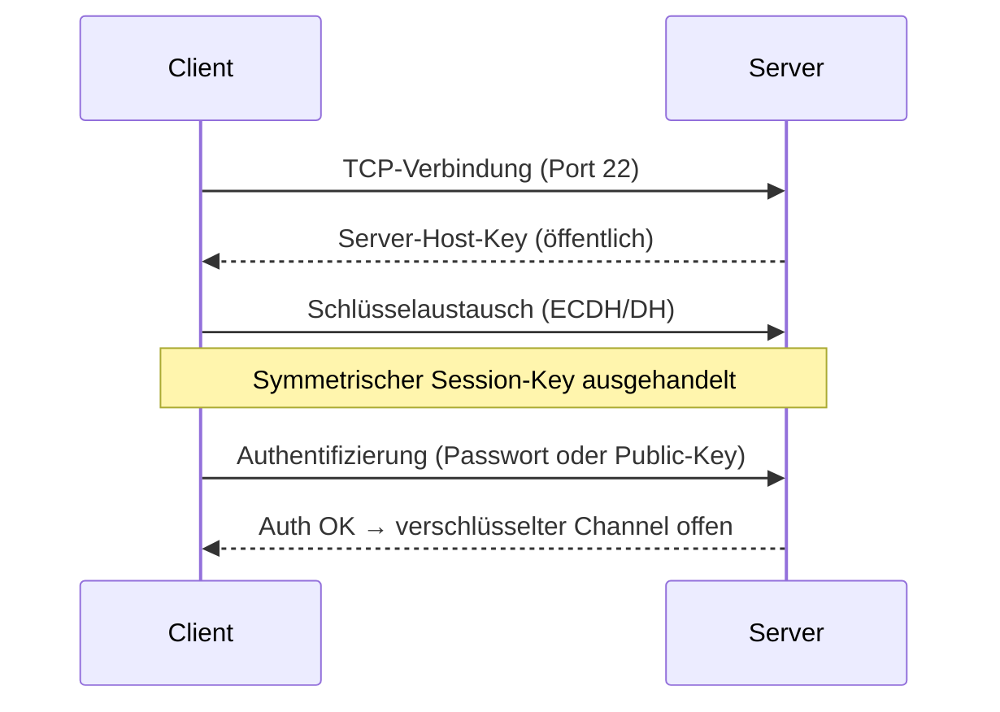

[[Netzwerkdienste|zurück]]

---

# Telnet & SSH – Vergleich

Beide Protokolle ermöglichen **Remote-Zugriff auf die CLI** von Netzwerkgeräten und Servern – der entscheidende Unterschied liegt in der Sicherheit.

## Telnet

- **Port:** TCP 23
- **Verschlüsselung:** keine – alles im Klartext (Passwörter, Befehle, Ausgaben)
- **Authentifizierung:** Passwort (unverschlüsselt übertragen)
- **RFC:** 854
- **Einsatz heute:** nur noch im isolierten Labor – nie im Produktivnetz

## SSH (Secure Shell)

- **Port:** TCP 22
- **Verschlüsselung:** symmetrisch (AES) nach asymmetrischem Schlüsselaustausch
- **Authentifizierung:** Passwort oder Public-Key (deutlich sicherer)
- **RFC:** 4251–4254
- **Versionen:** SSHv1 (kompromittiert, veraltet) → nur **SSHv2** nutzen

## Vergleich

| Merkmal | Telnet | SSH |
|---------|--------|-----|
| Port | TCP 23 | TCP 22 |
| Verschlüsselung | ❌ Klartext | ✅ AES |
| Passwort-Schutz | ❌ | ✅ |
| Man-in-the-Middle | leicht möglich | durch Host-Keys verhindert |
| Authentifizierung | Passwort | Passwort / Public-Key / Cert |
| Tunneling | ❌ | ✅ (Port-Forwarding) |
| Produktiveinsatz | ❌ | ✅ |

## SSH-Funktionsweise



**Host-Key-Prüfung:** Beim ersten Verbinden wird der Server-Public-Key in `~/.ssh/known_hosts` gespeichert. Bei Änderung → Warnung (möglicher MITM-Angriff).

## SSH Public-Key-Authentifizierung

```bash
# Schlüsselpaar erzeugen (Client)
ssh-keygen -t ed25519 -C "mein-kommentar"

# Public Key auf Server deployen
ssh-copy-id user@server

# Verbindung ohne Passwort
ssh user@server
```

**Vorteil:** kein Passwort übertragen, kein Brute-Force möglich (Private Key bleibt lokal).

## SSH-Tunneling (Port-Forwarding)

```bash
# Local Forwarding: lokaler Port 8080 → Remote-Server Port 80
ssh -L 8080:zielhost:80 user@jump-host

# Dynamic (SOCKS-Proxy)
ssh -D 1080 user@server
```

> [!important] **Kernregel**
> Telnet ist **verboten** im Produktionsnetz – einzige Ausnahme: physisch isoliertes Testlabor ohne Außenanbindung.

> [!warning] **Achtung Falle**
> SSHv1 hat bekannte Schwachstellen und gilt als gebrochen. Immer explizit **SSHv2** konfigurieren (`Protocol 2` in sshd_config).

> [!tip] **Merksatz**
> **T**elnet = **T**ransparentes (lesbares) Klartext-Protokoll – **S**SH = **S**ichere **S**chale mit Verschlüsselung.
