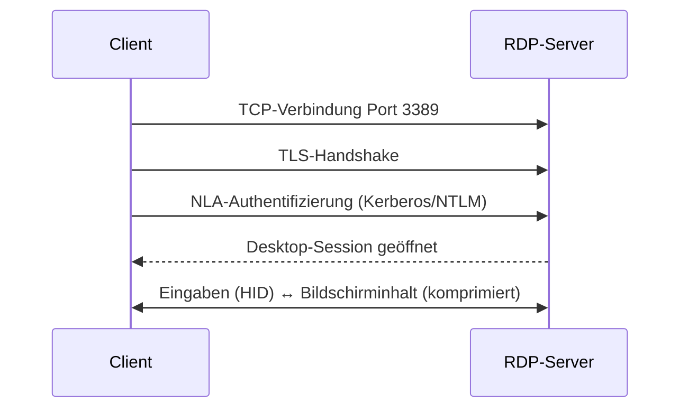

[[Netzwerk-Client|zurück]]

---

# Thin Clients & RDP

Thin Clients sind ressourcenarme Endgeräte, die Rechenarbeit auf Server auslagern. RDP ist das dominante Protokoll für Remote-Desktop-Zugriff unter Windows.

## Client-Typen im Vergleich

| Typ | Lokale Ressourcen | Rechenarbeit | Verwaltung |
|---|---|---|---|
| **Fat Client** | Vollständige Hardware | Lokal | Hoher Aufwand (je Gerät) |
| **Thin Client** | Minimal (CPU, RAM, Flash) | Server-seitig | Zentral, einfach |
| **Zero Client** | Nur Netzwerk-Chip | Vollständig Server | Sehr einfach, kein OS lokal |
| **Soft Client** | Standard-PC | Server-seitig (per Software) | Via Software/VDI-Client |

> [!tip] **Merksatz**
> Thin Client = **dümmes Endgerät, schlaue Infrastruktur**. Je dümmer der Client, desto zentralisierter die Verwaltung.

## RDP – Remote Desktop Protocol

- **Port:** TCP **3389**
- **Entwickler:** Microsoft
- **Zweck:** Grafische Remote-Sitzung auf Windows-Maschine (Server oder Desktop)
- **Verschlüsselung:** TLS (seit RDP 8.x Standard)
- **Authentifizierung:** NLA (Network Level Authentication) empfohlen – prüft Credentials *vor* Sitzungsaufbau

### RDP-Verbindungsaufbau (vereinfacht)



### RDP-Funktionen

| Feature | Beschreibung |
|---|---|
| **RemoteApp** | Einzelne Anwendung erscheint wie lokale App (kein vollständiger Desktop) |
| **Laufwerksumleitung** | Lokale Laufwerke im Remote-Desktop verfügbar |
| **Druckerumleitung** | Lokale Drucker im Remote-Desktop nutzbar |
| **Clipboard-Sharing** | Copy/Paste zwischen lokal und remote |
| **Multi-Monitor** | Mehrere Bildschirme in Remote-Session |
| **Audio-Umleitung** | Audio vom Server auf lokales Gerät |

> [!warning] **Achtung Falle**
> RDP Port 3389 direkt ins Internet exponieren = massives Sicherheitsrisiko (Brute-Force, Exploits). Immer via VPN oder RD-Gateway tunneln!

## VDI – Virtual Desktop Infrastructure

VDI geht weiter als einfaches RDP: Jeder Nutzer bekommt eine **dedizierte virtuelle Maschine** (oder eine Session in einem gemeinsamen Pool).

```
Nutzer → Thin Client → VDI-Broker → VM (Windows 10/11)
                                   ↕
                              Hypervisor (VMware, Hyper-V, Citrix)
```

| Modell | Beschreibung |
|---|---|
| **Persistente VDI** | Jeder Nutzer hat „seine" VM – bleibt zwischen Sessions erhalten |
| **Non-Persistente VDI** | VM wird nach Abmeldung zurückgesetzt (stateless) |
| **Session-basiert (RDS)** | Mehrere Nutzer teilen eine Windows-Server-Session |

## Citrix / VMware Horizon / MS RDS

| Produkt | Hersteller | Protokoll |
|---|---|---|
| Citrix Virtual Apps & Desktops | Citrix | ICA/HDX |
| VMware Horizon | VMware (Broadcom) | PCoIP / Blast Extreme |
| Microsoft RDS | Microsoft | RDP |

> [!important] **Kernregel**
> RDS (Remote Desktop Services) = Microsoft-Lösung für Session-basiertes Arbeiten.  
> VDI = jeder Nutzer hat eine eigene VM.  
> Thin Client verbindet sich per Protokoll (RDP/ICA/PCoIP) zum Server.
