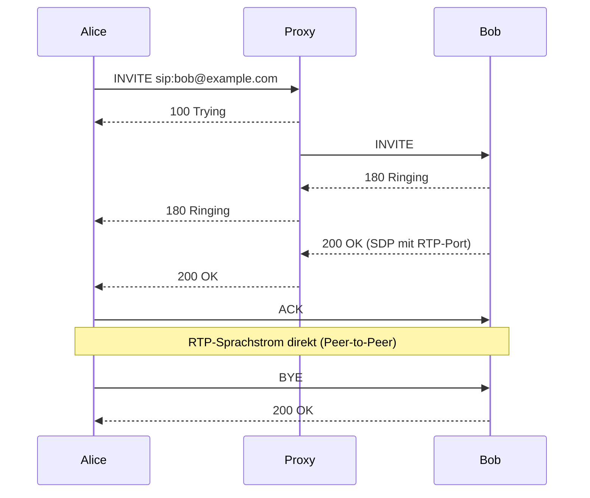

[[Netzwerkdienste|zurück]]

---

# Voice over IP – VoIP, SIP & TK-Anlagen

VoIP überträgt Sprachkommunikation über IP-Netze statt klassischer Telefonleitungen. Zentrale Protokolle: **SIP** (Signalisierung) und **RTP** (Sprachdaten).

## Protokollarchitektur

```text
[Telefon/Softphone]  ──SIP──►  [SIP-Server / PBX]  ──SIP──►  [Gegenstelle]
                     ◄──────────────RTP (Sprachdaten direkt)──────────────►
```

VoIP trennt strikt zwischen:
- **Signalisierung:** Verbindungsaufbau, -abbau, Rufweiterleitung (SIP, H.323)
- **Nutzdaten:** Sprachpakete während des Gesprächs (RTP)

## SIP (Session Initiation Protocol)

RFC 3261 – textbasiertes Protokoll (ähnlich HTTP-Syntax) für Signalisierung.

**Transport:** UDP **5060** (Standard) / TCP 5060 / TLS 5061 (SIPS)

**SIP-Komponenten:**

| Komponente | Funktion |
|-----------|----------|
| **UA (User Agent)** | Client (Telefon, Softphone) |
| **Proxy Server** | Vermittelt SIP-Anfragen |
| **Registrar** | Speichert, wo ein SIP-User erreichbar ist (Registrierung) |
| **B2BUA** | Back-to-Back UA – PBX-Funktion, kontrolliert beide Seiten |
| **SBC (Session Border Controller)** | Grenzknoten zwischen Netzen (NAT, Sicherheit) |

**Rufaufbau (vereinfacht):**


**SIP-Statuscodes (analog HTTP):**

| Code | Bedeutung |
|------|-----------|
| 100 | Trying |
| 180 | Ringing |
| 200 | OK |
| 401 | Unauthorized (Auth erforderlich) |
| 404 | Not Found (User unbekannt) |
| 486 | Busy Here |
| 503 | Service Unavailable |

## RTP (Real-Time Protocol)

RFC 3550 – transportiert Sprachdaten (und Video) in Echtzeit.

- **Transport:** UDP (dynamische Ports, typisch **16384–32767**)
- **Kein Verbindungsaufbau** – pure Datenpakete mit Sequenznummer + Timestamp
- **RTCP (Control Protocol):** Begleitprotokoll auf Port+1 – liefert Statistiken (Jitter, Paketverlust)

**Sprachcodecs:**

| Codec | Bitrate | Qualität | Einsatz |
|-------|---------|----------|---------|
| G.711 (a-law/µ-law) | 64 kbit/s | gut | PSTN-Standard |
| G.729 | 8 kbit/s | gut | WAN, Bandbreite sparen |
| G.722 | 48–64 kbit/s | HD-Voice | IP-Telefonie modern |
| Opus | variabel | sehr gut | WebRTC, Softphones |

## QoS für VoIP

Sprachpakete sind latenz- und jitter-sensitiv:

| Parameter | Anforderung |
|-----------|------------|
| Latenz (One-Way) | < 150 ms |
| Jitter | < 30 ms |
| Paketverlust | < 1% |

**QoS-Mechanismus:** VoIP-Pakete mit DSCP **EF (Expedited Forwarding, 46)** markieren → höchste Priorität in Queues.

```bash
# Cisco: VoIP-Traffic priorisieren
class-map match-all VOIP
 match ip dscp ef
policy-map QOS-POLICY
 class VOIP
  priority 512       ← garantierte Bandbreite kbit/s
```

## TK-Anlagen (Telekommunikationsanlagen)

Traditionelle und IP-basierte Telefonanlagen (PBX – Private Branch Exchange):

| Merkmal | Klassische TK-Anlage | IP-PBX / Cloud-PBX |
|---------|---------------------|-------------------|
| Technologie | ISDN, analog | SIP/VoIP |
| Leitungen | eigene Kupferleitungen | IP-Netz |
| Wartung | Vor-Ort | Remote / Cloud |
| Kosten | hohe Infrastruktur | geringer |
| Beispiele | Siemens HiPath | Asterisk, 3CX, Cisco UCM |

**Typische TK-Anlagen-Merkmale:**
- Durchwahlnummern (Intern-Rufnummern)
- Rufweiterleitung, Rufumleitung
- Konferenzschaltung
- Voicemail / Anrufbeantworter
- DECT-Integration (schnurlose Telefone)
- CTI (Computer-Telefonie-Integration, z.B. Anrufer-Popup im CRM)
- SIP-Trunk zum Provider (statt ISDN)

> [!important] **Kernregel**
> **SIP** = Signalisierung (Anruf auf-/abbauen), **RTP** = Sprachdaten (der eigentliche Ton). Ohne QoS leidet VoIP-Qualität sofort bei Netzlast.

> [!warning] **Achtung Falle**
> RTP läuft auf **dynamischen UDP-Ports** – nicht auf einem festen Port. Firewalls müssen RTP-Traffic explizit erlauben (ALG / SIP Helper oder dynamische Portfreigabe via SBC).

> [!tip] **Merksatz**
> SIP ist wie ein Telefonvermittler (stellt die Verbindung her), RTP ist wie das Telefonkabel (überträgt die Stimme).
